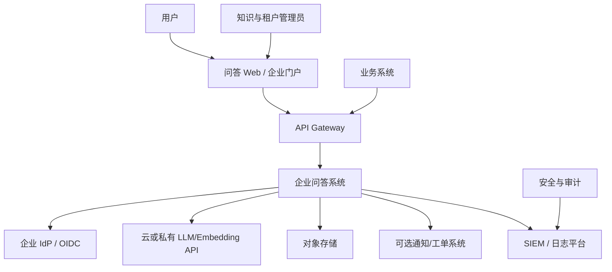
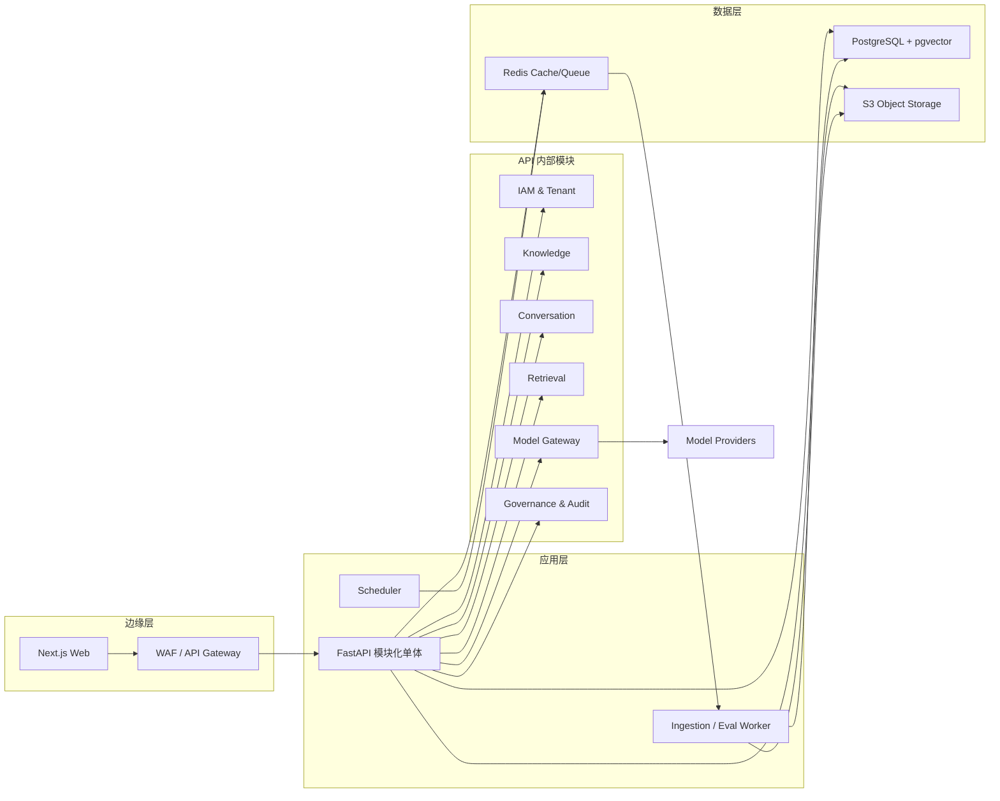
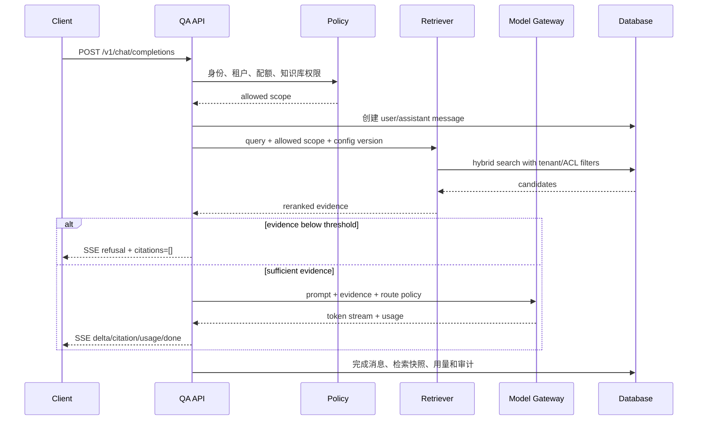
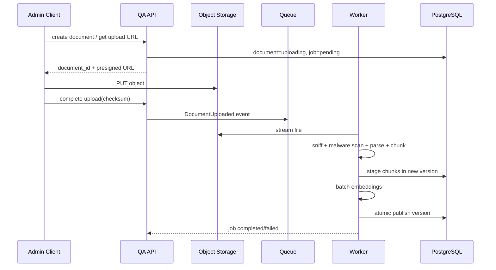

# 02. 总体架构与技术决策

## 1. 架构原则

1. **证据优先**：检索结果和权限是回答的事实边界；资料不足时拒答。
2. **租户隔离默认开启**：每一层都携带服务端解析的租户上下文，缓存、队列、对象存储也不能例外。
3. **模型可替换**：业务层只依赖统一 Model Gateway，不把厂商 SDK 类型渗入领域模型。
4. **在线/离线隔离**：文档摄取由 Worker 承担；解析高峰不应拖垮聊天 API。
5. **先模块化单体**：用清晰模块、端口和事件建立边界；以可测量瓶颈触发拆分。
6. **配置可版本化**：Prompt、检索、模型路由、chunk 策略都是发布物，不是直接修改的环境变量。
7. **可观测即功能**：没有 trace、质量与成本数据的问答链路视为未完成。
8. **最小数据**：日志、评测和反馈只采集完成目的所需的数据，并有保留与删除规则。

## 2. 系统上下文



### 信任边界

- 浏览器、外部 API 调用方、用户上传文件和文档正文均属于不可信输入。
- 第三方模型 API 是外部数据处理方；只有允许外发的数据可进入请求。
- 对象存储、数据库和队列位于受控网络，但仍使用工作负载身份与最小权限。
- 管理员不是“完全可信”；高风险操作要审批、审计和可撤销。

## 3. 容器/组件视图



### 3.1 模块职责

| 模块 | 负责 | 不负责 |
|---|---|---|
| IAM & Tenant | 身份映射、角色、组、作用域、租户上下文 | 企业 IdP 自身账号生命周期 |
| Knowledge | 知识库、文档、版本、ACL、摄取编排 | LLM 生成答案 |
| Retrieval | 查询改写、ACL 过滤、混合召回、重排、上下文组装 | 原始文件永久存储 |
| Conversation | 会话、消息、SSE、取消、反馈 | 供应商 SDK 细节 |
| Model Gateway | 能力发现、统一请求、路由、重试、熔断、用量 | 业务权限决策 |
| Governance | Prompt/配置版本、配额、审计、评测记录 | 通用日志采集代理 |
| Worker | 文件扫描/解析/切分/Embedding、离线评测 | 用户同步请求 |

模块之间通过应用服务接口和领域事件交互，禁止跨模块直接修改对方表。首版可共享 PostgreSQL 实例，但 schema/Repository 边界要明确。

## 4. 在线问答时序



关键实现点：

- 在调用模型前完成鉴权、配额预检和证据阈值判断。
- SSE 连接与后端生成任务解耦到足够程度，客户端断线时按策略取消或完成持久化。
- 检索快照只保存必要证据 ID/分数/版本；受限正文不进入普通日志。
- 最终用量以供应商返回为准；缺失时使用 tokenizer 估算并标记 `estimated=true`。

## 5. 文档摄取时序与状态机



状态机：

```text
uploading -> uploaded -> scanning -> parsing -> chunking -> embedding -> ready
                  \-> rejected
                              \-> failed -> retrying -> ...
ready -> reindexing -> ready
ready -> archived -> deleting -> deleted
```

每个 Worker 步骤必须以 `(document_id, version, stage)` 幂等；消息采用至少一次投递，消费者依赖幂等键和数据库唯一约束，而不是假设队列只投递一次。

## 6. Model Gateway 端口

领域层只依赖以下能力，不直接依赖具体厂商 SDK：

```python
class ModelGateway(Protocol):
    async def stream_chat(self, request: ChatRequest) -> AsyncIterator[ChatEvent]: ...
    async def embed(self, request: EmbeddingRequest) -> EmbeddingResult: ...
    async def health(self, route_id: str) -> ProviderHealth: ...
    async def count_tokens(self, model: str, messages: list[Message]) -> TokenCount: ...
```

`ChatRequest` 至少包含 `tenant_id`、`request_id`、`model_policy_id`、`messages`、`temperature`、`max_output_tokens`、`timeout_ms` 和可选工具；`ChatEvent` 统一为 `delta`、`tool_call`、`usage`、`error`、`done`。提供方适配器负责字段转换、错误归一化、供应商 request ID 和用量提取。

## 7. 数据一致性与可靠性模式

- **事务 + Outbox**：文档/配置发布与事件写入同一数据库事务，由发布器转发到队列。
- **幂等 API**：上传、启动摄取、发起非流式生成等写接口支持 `Idempotency-Key`；保存请求哈希，键复用但请求体不同返回冲突。
- **乐观锁**：知识库、Prompt、配置使用 `version` 或 `updated_at` + `If-Match` 防止覆盖。
- **重试分类**：只重试超时、429 和部分 5xx；参数/鉴权/内容安全错误不重试。指数退避加抖动且有总预算。
- **熔断与隔舱**：每个提供方/模型独立并发池和断路器，避免一个上游耗尽全部连接。
- **降级**：知识问答优先返回可验证的检索片段或明确失败，不用无依据通用模型答案掩盖故障。
- **删除传播**：文档下线事务提交后立即使在线过滤不可见，再异步清理向量、缓存和对象。

## 8. 缓存设计

| 缓存 | Key 必须包含 | TTL/失效 |
|---|---|---|
| 身份/组 | tenant、subject、group version | 短 TTL；禁用事件主动失效 |
| 检索 | tenant、ACL fingerprint、KB/version、query、retrieval config | 文档/ACL/配置发布时失效 |
| 语义答案 | tenant、ACL fingerprint、knowledge version set、prompt/model policy、normalized query | 短 TTL；保留原引用 |
| 模型能力 | provider、model、config version | 配置发布或健康异常时失效 |

禁止只以问题文本作为答案缓存键；这会造成跨租户、跨权限和旧知识泄露。

## 9. 部署拓扑

### 本地开发

`web + api + worker + postgres/pgvector + redis + minio + otel-collector` 使用 Compose。模型可接沙箱 API 或本地兼容端点；测试密钥从开发者本机 secret store 注入。

### 预生产/生产

- Kubernetes 多可用区；Web/API/Worker 独立 Deployment 和 HPA。
- 托管 PostgreSQL、Redis、对象存储优先；生产数据服务启用多副本、备份和加密。
- API Pod 无状态；SSE 连接需要合理的网关 idle timeout 与优雅终止。
- 摄取 Worker 按队列深度扩缩，解析与 Embedding 可用不同队列/并发限制。
- 网络策略仅允许必要东西向/南北向通信；模型出网走受控 egress。

Kubernetes 官方生产指南强调高可用、容量、安全访问与资源限制等规划；本文的生产拓扑据此设置评审项：[Production environment](https://kubernetes.io/docs/setup/production-environment/)。

## 10. 技术选型取舍

| 决策 | 选择 | 理由 | 何时复审 |
|---|---|---|---|
| 服务形态 | 模块化单体 + Worker | 便于学习、事务、调试和快速交付 | 独立扩缩/团队/故障边界形成证据时 |
| 主数据库 | PostgreSQL | 事务、JSON、全文与生态成熟 | 写吞吐/容量达到单集群瓶颈 |
| 向量 | pgvector | 与 ACL/元数据同库过滤，运维简单 | 数千万向量或 P95/召回不达标 |
| 队列 | Redis 起步 | 本地简单、吞吐足够 | 需要长保留、重放、多消费者生态时评估 Kafka |
| API | REST + SSE | 浏览器友好、简单可观测 | 双向音视频/复杂实时协作时评估 WebSocket/gRPC |
| 对象存储 | S3 接口 | 云和本地兼容、预签名上传 | 无 |
| 配置 | DB 版本化发布 | 可回滚、审计、复现 | 无 |

## 11. 架构决策记录（ADR）

每个重要决策建立 `ADR-NNN-title.md`，包含 Context、Decision、Alternatives、Consequences、Security/Cost、Status、Review date。首批 ADR：

- ADR-001：模块化单体而非微服务。
- ADR-002：PostgreSQL + pgvector 作为首版检索存储。
- ADR-003：REST + SSE 流式协议。
- ADR-004：统一 Model Gateway 与多供应商策略。
- ADR-005：租户逻辑隔离 + 可选 PostgreSQL RLS 双保险。
- ADR-006：文档新版本原子发布，历史版本不可变。
- ADR-007：Prompt/检索配置版本化与发布审批。
- ADR-008：评测门禁作为知识/配置发布条件。

ADR 状态使用 Proposed → Accepted → Superseded/Deprecated。改变外部契约或安全边界的决策必须先更新 ADR 再写代码。

## 12. 拆分服务的量化触发器

只有满足以下至少一项并有压测/运营证据时才拆分：

- 摄取 Worker 的发布节奏或资源类型与在线 API 长期冲突。
- 单模块需要独立扩展至其他模块 5 倍以上实例，且成本显著。
- 故障域需要隔离，当前资源池导致 SLO 关联失败。
- 团队所有权稳定分离，并可承担独立 on-call、版本和契约治理。
- 数据合规要求形成独立网络/存储边界。

拆分时先抽取 Model Gateway 或 Ingestion，保持 API 契约和 outbox 事件不变；不要按数据库表随意切服务。

