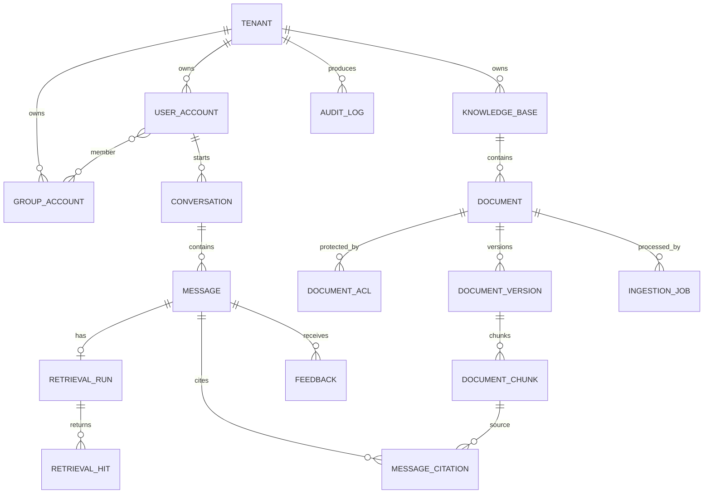

# 03. 数据模型与字段字典

## 1. 设计约定

- 主键统一使用 UUIDv7（数据库不支持时由应用生成），避免暴露业务规模并保持大致有序。
- 所有租户业务表含 `tenant_id uuid not null`；Repository 方法必须显式接收 `TenantContext`。
- 时间使用 `timestamptz` 并以 UTC 存储，API 输出 RFC 3339。
- 可变业务对象含 `version bigint` 和 `updated_at`；不可变发布版本以新行表达。
- 软删除使用 `deleted_at`；对安全要求“立即不可见”的对象同时更新状态并失效缓存。
- 自定义扩展放在受 schema 校验的 `jsonb`，高频查询字段不得偷懒塞进 JSON。
- 密钥只存 Secret Manager 引用；不得把 API Key、访问令牌、私钥写入数据库或日志。
- 向量维度与知识库 Embedding 配置绑定；更换模型以新索引版本重建，不在原列混写不同维度。

## 2. 实体关系

## 3. 身份与租户

### 3.1 `tenants`

| 字段 | 类型 | 必填 | 规则/说明 |
|---|---|---:|---|
| `id` | uuid | ✓ | 主键 |
| `code` | varchar(64) | ✓ | 全局唯一、不可变、URL/指标友好 |
| `name` | varchar(200) | ✓ | 展示名 |
| `status` | varchar(24) | ✓ | `active/suspended/deleting/deleted` |
| `default_locale` | varchar(16) | ✓ | 默认 `zh-CN` |
| `timezone` | varchar(64) | ✓ | IANA 时区，如 `Asia/Shanghai` |
| `settings` | jsonb | ✓ | 通过 JSON Schema 校验的租户 UI/策略扩展 |
| `data_classification` | varchar(24) | ✓ | `public/internal/confidential/restricted` 上限 |
| `created_at/updated_at` | timestamptz | ✓ | 审计时间 |
| `deleted_at` | timestamptz |  | 逻辑删除 |

约束：`code` 创建后不可修改；`suspended` 租户禁止新问答和上传，只允许授权管理员导出/处置。

### 3.2 `users`

| 字段 | 类型 | 必填 | 规则/说明 |
|---|---|---:|---|
| `id` | uuid | ✓ | 内部用户 ID |
| `tenant_id` | uuid | ✓ | 同一外部 subject 可映射多个租户 |
| `auth_issuer` | varchar(512) | ✓ | OIDC issuer |
| `auth_subject` | varchar(255) | ✓ | OIDC `sub`，与 issuer/tenant 联合唯一 |
| `email` | varchar(320) |  | 不作为稳定主键；规范化但保留显示值策略 |
| `display_name` | varchar(200) | ✓ | 展示名 |
| `status` | varchar(24) | ✓ | `invited/active/disabled/deleted` |
| `locale` | varchar(16) | ✓ | 用户语言 |
| `last_login_at` | timestamptz |  | 最近成功登录 |
| `created_at/updated_at/deleted_at` | timestamptz |  | 生命周期 |

唯一索引：`(tenant_id, auth_issuer, auth_subject)`；查询用户必须同时限定 `tenant_id`。

### 3.3 `roles`、`user_roles`、`groups`、`group_members`

| 表 | 核心字段 | 说明 |
|---|---|---|
| `roles` | `id, tenant_id, code, name, permissions jsonb, is_system` | 权限值使用动作集合，如 `kb:write` |
| `user_roles` | `tenant_id, user_id, role_id, valid_from, valid_until, granted_by` | 支持临时授权 |
| `groups` | `id, tenant_id, external_id, name, source, status` | `source=oidc/scim/manual` |
| `group_members` | `tenant_id, group_id, user_id, source, synced_at` | 联合主键，目录同步可重建 |

系统角色不可删除，只能复制为自定义角色；权限变更产生 `authorization_version` 并主动失效缓存。

## 4. 知识与文档

### 4.1 `knowledge_bases`

| 字段 | 类型 | 必填 | 规则/说明 |
|---|---|---:|---|
| `id` | uuid | ✓ | 主键 |
| `tenant_id` | uuid | ✓ | 租户隔离 |
| `code` | varchar(64) | ✓ | 租户内唯一 |
| `name` | varchar(200) | ✓ | 名称 |
| `description` | text |  | 用途与内容边界 |
| `status` | varchar(24) | ✓ | `active/archived/reindexing` |
| `classification` | varchar(24) | ✓ | 知识库密级 |
| `embedding_config_version_id` | uuid | ✓ | 当前发布的 Embedding 配置 |
| `retrieval_config_version_id` | uuid | ✓ | 当前发布的检索配置 |
| `knowledge_version` | bigint | ✓ | 任一可检索内容/ACL 改变即递增，用于缓存失效 |
| `created_by` | uuid | ✓ | 创建人 |
| `created_at/updated_at/deleted_at` | timestamptz |  | 生命周期 |

### 4.2 `documents`

`documents` 表示逻辑文档，具体内容存于 `document_versions`。

| 字段 | 类型 | 必填 | 规则/说明 |
|---|---|---:|---|
| `id` | uuid | ✓ | 逻辑文档 ID |
| `tenant_id` / `knowledge_base_id` | uuid | ✓ | 两级边界，需验证 KB 同租户 |
| `title` | varchar(500) | ✓ | 展示标题 |
| `source_type` | varchar(32) | ✓ | `upload/url/connector/api` |
| `source_uri` | text |  | 外部来源标识；返回前脱敏 |
| `external_id` | varchar(512) |  | 连接器源 ID，租户/KB/来源内唯一 |
| `status` | varchar(24) | ✓ | `draft/processing/ready/archived/deleting/deleted/failed` |
| `current_version_id` | uuid |  | 当前已发布版本；发布事务内切换 |
| `classification` | varchar(24) | ✓ | 不低于 KB 要求 |
| `acl_mode` | varchar(16) | ✓ | `inherit/restricted/public_in_tenant` |
| `metadata` | jsonb | ✓ | 业务元数据，受白名单与大小限制 |
| `created_by` | uuid | ✓ | 创建人 |
| `created_at/updated_at/deleted_at` | timestamptz |  | 生命周期 |

### 4.3 `document_versions`

| 字段 | 类型 | 必填 | 规则/说明 |
|---|---|---:|---|
| `id` | uuid | ✓ | 不可变版本 ID |
| `tenant_id/document_id` | uuid | ✓ | 隔离与归属 |
| `version_no` | integer | ✓ | 文档内从 1 递增 |
| `filename` | varchar(512) | ✓ | 清洗后的原文件名，不作为 object key |
| `mime_type` | varchar(255) | ✓ | 内容嗅探结果，不信任客户端声明 |
| `size_bytes` | bigint | ✓ | 上传完成时确认 |
| `sha256` | char(64) | ✓ | 内容校验与幂等 |
| `object_key` | text | ✓ | 内部存储 key，永不直接暴露给客户端 |
| `parser_name/parser_version` | varchar |  | 可复现解析结果 |
| `chunk_config_version_id` | uuid | ✓ | 切分配置版本 |
| `embedding_config_version_id` | uuid | ✓ | Embedding 模型与维度版本 |
| `language` | varchar(16) |  | 检测语言 |
| `page_count` | integer |  | 可用时记录 |
| `status` | varchar(24) | ✓ | `staged/published/superseded/rejected/failed/deleted` |
| `published_at` | timestamptz |  | 发布时刻 |
| `created_by/created_at` | uuid/timestamptz | ✓ | 来源审计 |

唯一约束：`(tenant_id, document_id, version_no)`；可选内容去重索引为 `(tenant_id, knowledge_base_id, sha256)`。

### 4.4 `document_chunks`

| 字段 | 类型 | 必填 | 规则/说明 |
|---|---|---:|---|
| `id` | uuid | ✓ | chunk ID |
| `tenant_id/kb_id/document_id/document_version_id` | uuid | ✓ | 冗余隔离列便于过滤与分区 |
| `sequence_no` | integer | ✓ | 版本内顺序 |
| `content` | text | ✓ | 规范化文本；按密级加密/限制日志 |
| `content_hash` | char(64) | ✓ | chunk 去重和增量 Embedding |
| `token_count` | integer | ✓ | 指定 tokenizer 统计 |
| `page_from/page_to` | integer |  | 页码；非分页文档为空 |
| `section_path` | text[] |  | 标题层级，如 `{第三章,报销}` |
| `char_start/char_end` | integer |  | 原始解析文本位置，可选 |
| `metadata` | jsonb | ✓ | 表格、语言、来源等受控字段 |
| `search_text` | tsvector | ✓ | PostgreSQL 关键词检索列 |
| `embedding` | vector(N) | ✓ | N 由基线配置固定，如 1536；多维度需独立表/索引 |
| `status` | varchar(16) | ✓ | `staged/active/inactive/deleted` |
| `created_at/deleted_at` | timestamptz |  | 生命周期 |

关键索引：

- B-tree `(tenant_id, knowledge_base_id, status, document_version_id)`。
- GIN `search_text` 用于全文召回。
- HNSW/IVFFlat `embedding` 用于向量召回；索引选择需以真实数据压测。
- 唯一 `(tenant_id, document_version_id, sequence_no)`。

ACL 条件必须和向量/全文召回在同一个查询计划或安全候选集合中生效，不能先全局取 top-k 再在应用层删除。

### 4.5 `document_acl`

| 字段 | 类型 | 必填 | 规则/说明 |
|---|---|---:|---|
| `id` | uuid | ✓ | 主键 |
| `tenant_id/document_id` | uuid | ✓ | 资源边界 |
| `principal_type` | varchar(16) | ✓ | `user/group/role` |
| `principal_id` | uuid | ✓ | 主体 ID |
| `permission` | varchar(16) | ✓ | 首版仅 `read/manage` |
| `effect` | varchar(8) | ✓ | 首版推荐只用 `allow`，避免 deny 冲突复杂度 |
| `created_by/created_at` | uuid/timestamptz | ✓ | 审计 |

联合唯一：`(tenant_id, document_id, principal_type, principal_id, permission)`。修改 ACL 后递增知识库 `knowledge_version`、清理缓存并记录审计。

### 4.6 `ingestion_jobs`

| 字段 | 类型 | 必填 | 规则/说明 |
|---|---|---:|---|
| `id` | uuid | ✓ | 任务 ID |
| `tenant_id/document_id/document_version_id` | uuid | ✓ | 归属 |
| `status` | varchar(24) | ✓ | `pending/running/retrying/succeeded/failed/cancelled/dead_letter` |
| `stage` | varchar(24) | ✓ | `scan/parse/chunk/embed/index/publish` |
| `progress` | numeric(5,2) | ✓ | 0–100，仅展示参考 |
| `attempt` / `max_attempts` | integer | ✓ | 重试控制 |
| `idempotency_key` | varchar(128) | ✓ | 步骤幂等 |
| `error_code` | varchar(64) |  | 稳定机器错误码 |
| `error_detail_safe` | text |  | 可向管理员展示，禁止堆栈/密钥 |
| `metrics` | jsonb | ✓ | 页数、chunk 数、token、各阶段耗时 |
| `started_at/finished_at/next_retry_at` | timestamptz |  | 调度 |
| `created_at/updated_at` | timestamptz | ✓ | 审计 |

## 5. 会话、消息与检索

### 5.1 `conversations`

| 字段 | 类型 | 必填 | 规则/说明 |
|---|---|---:|---|
| `id` | uuid | ✓ | 会话 ID |
| `tenant_id/user_id` | uuid | ✓ | 所有人 |
| `title` | varchar(300) | ✓ | 可异步生成，需安全过滤 |
| `status` | varchar(16) | ✓ | `active/archived/deleted` |
| `channel` | varchar(32) | ✓ | `web/api/feishu/...` |
| `default_kb_ids` | uuid[] | ✓ | 仅是偏好，问答时重新鉴权 |
| `metadata` | jsonb | ✓ | 外部工单 ID 等受控数据 |
| `created_at/updated_at/deleted_at` | timestamptz |  | 生命周期 |

### 5.2 `messages`

| 字段 | 类型 | 必填 | 规则/说明 |
|---|---|---:|---|
| `id` | uuid | ✓ | 消息 ID |
| `tenant_id/conversation_id` | uuid | ✓ | 归属 |
| `parent_message_id` | uuid |  | 重试/分支来源 |
| `role` | varchar(16) | ✓ | `user/assistant/system/tool`；外部 API 通常只允许 user |
| `content` | text | ✓ | 正文；按隐私策略加密/保留 |
| `content_format` | varchar(16) | ✓ | `text/markdown/json` |
| `status` | varchar(16) | ✓ | `pending/streaming/completed/failed/cancelled/blocked` |
| `sequence_no` | bigint | ✓ | 会话内单调递增 |
| `model_route_id/model_name` | varchar |  | Assistant 使用的最终路由 |
| `prompt_version_id` | uuid |  | 不可变 Prompt 快照 |
| `retrieval_run_id` | uuid |  | 本次检索 |
| `input_tokens/output_tokens` | integer |  | 用量 |
| `cost_amount/cost_currency` | numeric/char(3) |  | 成本快照 |
| `finish_reason` | varchar(32) |  | `stop/length/cancelled/content_filter/error` |
| `safety_labels` | jsonb | ✓ | 只存标签/分数，不复制敏感输入 |
| `provider_request_id/trace_id` | varchar |  | 调试关联 |
| `latency_ms/first_token_ms` | integer |  | 端到端与 TTFT |
| `error_code` | varchar(64) |  | 失败机器码 |
| `created_at/completed_at/deleted_at` | timestamptz |  | 生命周期 |

### 5.3 `retrieval_runs` 与 `retrieval_hits`

`retrieval_runs`：`id, tenant_id, message_id, normalized_query, query_hash, kb_ids, retrieval_config_version_id, acl_fingerprint, candidate_count, returned_count, top_score, latency_ms, cache_hit, created_at`。

`retrieval_hits`：`tenant_id, retrieval_run_id, chunk_id, rank, vector_score, keyword_score, rerank_score, selected_for_context, token_count, created_at`。

`normalized_query` 是否落库由隐私策略决定；可仅保存 HMAC/hash 和脱敏摘要。严禁把用户问题作为 Prometheus label。

### 5.4 `message_citations`

| 字段 | 类型 | 必填 | 规则/说明 |
|---|---|---:|---|
| `id` | uuid | ✓ | 引用 ID |
| `tenant_id/message_id/chunk_id` | uuid | ✓ | 来源链 |
| `ordinal` | integer | ✓ | 回答中的 `[1]` 顺序 |
| `document_id/document_version_id` | uuid | ✓ | 冗余固定历史版本 |
| `page_from/page_to` | integer |  | 展示页码 |
| `quote_start/quote_end` | integer |  | chunk 内引用字符范围，可选 |
| `display_quote` | text |  | 短摘录；返回前仍需鉴权 |
| `relevance_score` | numeric |  | 重排分数 |
| `created_at` | timestamptz | ✓ | 审计 |

## 6. 配置、用量、反馈与审计

### 6.1 版本化配置

统一模式：主对象（逻辑标识）+ 不可变版本表。

| 配置 | 关键版本字段 |
|---|---|
| 模型路由 | `provider_ref, model, capabilities, timeout_ms, retry_policy, fallback_routes, data_policy, price_snapshot` |
| Prompt | `template, variables_schema, output_schema, safety_rules, changelog, checksum` |
| 检索 | `top_k_vector, top_k_keyword, fusion, reranker, final_k, score_threshold, context_budget` |
| 切分 | `parser, strategy, max_tokens, overlap_tokens, separators, table_policy` |
| Embedding | `provider_ref, model, dimension, normalize, batch_size` |

版本状态：`draft/approved/published/retired`；发布必须原子切换主对象的 `current_version_id`，并写审计/outbox。

### 6.2 `feedback`

`id, tenant_id, message_id, user_id, rating(-1/1), reason_code, comment, expected_answer, status(new/reviewed/actioned/dismissed), tags, created_at, reviewed_by, reviewed_at`。

反馈评论仍是不可信输入；不得原样拼入训练/Prompt。用于评测集前必须脱敏、审核和标注数据来源/许可。

### 6.3 `usage_ledger`

`id, tenant_id, user_id, request_id, message_id, provider, model, operation(chat/embed/rerank), input_tokens, output_tokens, cached_tokens, amount, currency, price_version, estimated, occurred_at`。

用量台账采用追加写，修正以冲正记录表达；按月分区，财务口径不得从会话表临时聚合替代。

### 6.4 `audit_logs`

| 字段 | 说明 |
|---|---|
| `id, occurred_at, tenant_id` | 事件身份与时间 |
| `actor_type, actor_id, actor_display_safe` | user/service/system，不保存多余隐私 |
| `action` | 如 `document.publish`、`prompt.rollback` |
| `resource_type, resource_id` | 目标资源 |
| `result` | `success/denied/failure` |
| `request_id, trace_id, source_ip_hash, user_agent_class` | 关联与安全分析；IP 处理按政策 |
| `changes` | 只记录允许字段的 before/after 或字段名，密钥永不记录 |
| `reason, approval_id` | 高风险操作原因与审批 |
| `prev_hash, event_hash` | 可选哈希链/外部不可变存储增强防篡改 |

审计表仅追加，应用账号没有 UPDATE/DELETE 权限；导出走异步作业并产生二次审计。

### 6.5 `outbox_events` 与 `idempotency_records`

- `outbox_events(id, tenant_id, aggregate_type, aggregate_id, event_type, event_version, payload, occurred_at, published_at, attempts)`。
- `idempotency_records(tenant_id, actor_id, key, operation, request_hash, status, response_code, response_body_ref, expires_at)`。

Outbox payload 只携带 ID 和必要元数据，不携带文档全文。幂等记录设置合理 TTL；相同 key 但请求哈希不同返回 `409 IDEMPOTENCY_KEY_REUSED`。

## 7. 数据分类与保留基线

| 数据 | 分类示例 | 默认保留 | 删除/归档策略 |
|---|---|---:|---|
| 身份映射 | confidential | 在职期 + 审计期 | 禁用后最小化，按制度删除 |
| 原始文档/chunk | 继承文档密级 | 文档有效期 | 下线立即不可检索，异步安全删除 |
| 对话与消息 | confidential | 90 天（需业务确认） | 用户删除+策略任务，法律保留优先 |
| 检索快照 | confidential | 30–90 天 | 删除正文或只留 ID/分数 |
| 反馈/黄金集 | confidential | 按评测目的 | 脱敏、授权、可追溯 |
| 用量台账 | internal | 13–36 个月 | 分区归档，按财务制度 |
| 安全审计 | restricted | 12–36 个月 | 不可变归档，严格查询审批 |
| Trace/普通日志 | internal | 7–30 天 | 禁止密钥和完整受限正文 |

以上只是工程默认值。最终期限必须通过数据清单、业务目的、合同和适用法规评审确定。

## 8. 数据库安全与隔离

- 应用连接按 `api_rw`、`worker_rw`、`audit_append`、`migration_owner` 分权，禁止生产应用使用 owner。
- 所有查询显式包含 `tenant_id`；高敏部署可增加 PostgreSQL Row Level Security 作为双保险。
- RLS session 变量只能由可信连接中间件设置，连接归还池前必须清理，且后台任务显式绑定租户。
- 对象 key 采用 `tenant/{tenant_id}/documents/{document_id}/versions/{version_id}`，桶策略仍需工作负载身份约束。
- 备份、只读副本、分析仓库和日志同样属于数据边界，不能只保护主库。
- 生产数据禁止复制到开发环境；需要复现时使用合成数据或批准的不可逆脱敏快照。

## 9. 迁移与兼容规则

- 使用 expand/contract：先增加可空字段/新表并双写，再回填、切读，最后删除旧结构。
- 大表索引使用并发构建；迁移不得在发布窗口持有长时间排他锁。
- API 删除字段至少跨一个已公告的主版本；数据库列删除必须先证明所有代码不再读写。
- Embedding 维度或模型变化使用新版本/新列（或新表）并后台重建，原子切换后保留回滚窗口。
- 每次迁移提供 `up`、可行的 `down` 或明确的前向修复策略、数据校验 SQL、预计耗时与回滚触发器。

可执行的核心 DDL 骨架见 [schema.sql](schema.sql)。

