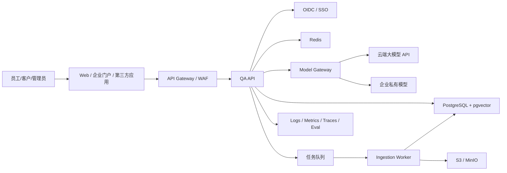

# 企业级大模型问答系统：项目文档包

> 文档版本：v1.5-s5  
> 基线日期：2026-07-16  
> 目标读者：产品经理、架构师、后端/前端/算法/测试/DevOps 工程师、安全与运维人员

## 1. 这套文档解决什么问题

本项目以“从零亲手建设一套可生产部署的企业知识问答系统”为目标。最终系统不是一个只有输入框和大模型 API 的演示，而是一套具备身份认证、租户与知识权限、文档摄取、混合检索、流式回答、引用溯源、评测、审计、监控、灰度发布与容灾能力的企业应用。

基线方案采用模块化单体加异步 Worker，避免学习阶段过早进入微服务复杂度；所有边界均以接口隔离，达到规模阈值后可拆分。默认技术栈如下：

| 层次 | 基线选型 | 可替代项 |
|---|---|---|
| Web | Next.js + TypeScript | Vue/Nuxt |
| API | Python 3.12 + FastAPI + Pydantic | Java/Spring Boot、Go |
| 异步任务 | Celery + Redis | Dramatiq、Kafka Consumer |
| 事务/向量数据 | PostgreSQL + pgvector | PostgreSQL + Milvus/OpenSearch |
| 对象存储 | S3 兼容存储（本地 MinIO） | 云对象存储 |
| 模型接入 | 自研 Model Gateway，兼容主流 Chat/Embedding API | LiteLLM 等网关 |
| 可观测性 | OpenTelemetry + Prometheus + Grafana + Loki/Tempo | 企业既有 APM |
| 本地部署 | Docker Compose | Podman Compose |
| 生产部署 | Kubernetes + Helm | 托管容器平台/虚拟机 |

## 2. 目标系统全景

## 3. 文档导航

| 文档 | 用途 | 主要责任人 |
|---|---|---|
| [项目上下文](../../PROJECT_CONTEXT.md) | 当前阶段、已接受决策、硬约束、开放问题和下一步 | 技术负责人/项目经理 |
| [S0 阶段基线包](s0/README.md) | 发现、数据、黄金集、威胁、容量、风险、Gate 与决策证据 | 产品/架构/安全/测试 |
| [S1 工程证据包](s1/README.md) | 工程骨架、OIDC/BFF、租户、会话、迁移、CI、测试、风险与 Gate | 全团队 |
| [S2 模型与流式聊天证据包](s2/README.md) | Model Gateway、Adapter、SSE、取消/重试、用量成本、测试与 Gate | 全团队 |
| [S3 安全文档摄取证据包](s3/README.md) | 隔离上传、解析分块、版本、ACL 与调试检索 | 全团队 |
| [S4 可溯源 RAG 证据包](s4/README.md) | Hybrid retrieval、rerank、grounding、引用、拒答、反馈与评测 | 全团队 |
| [S5 企业治理闭环证据包](s5/README.md) | 服务端目录态、集中授权、配置门禁、共享配额、审计和事件 | 全团队 |
| [ADR 目录](adr/README.md) | 不可变的重要架构和安全决策 | 架构/相关 Owner |
| [00-项目章程与范围](00-project-charter-and-scope.md) | 立项、边界、排期、预算假设、RACI、风险 | 项目经理/产品/架构 |
| [01-需求与应用场景](01-requirements-and-use-cases.md) | 角色、用户故事、功能与非功能需求、验收场景 | 产品/测试 |
| [02-总体架构与技术决策](02-architecture-and-decisions.md) | 系统边界、组件、调用链、技术取舍、ADR | 架构/研发 |
| [03-数据模型与字段字典](03-data-model.md) | 实体、字段、索引、状态机、数据生命周期 | 后端/DBA |
| [04-API 与事件契约](04-api-contracts.md) | REST、SSE、错误码、幂等、Webhook | 前后端/集成方 |
| [05-阶段计划与教学任务](05-stage-plan-and-tutorials.md) | 16 周开发阶段、每阶段实验、产物和退出条件 | 全团队 |
| [06-RAG、模型与提示词设计](06-rag-model-and-prompt-design.md) | 解析、切分、检索、重排、生成、拒答、成本 | 算法/后端 |
| [07-安全、权限与治理](07-security-and-governance.md) | 租户隔离、文档 ACL、提示注入、隐私、审计 | 安全/研发 |
| [08-测试与 AI 评测](08-testing-and-evaluation.md) | 测试金字塔、黄金集、RAG 指标、发布门禁 | 测试/算法 |
| [09-部署与 CI/CD](09-deployment-and-cicd.md) | 环境、流水线、数据库迁移、灰度、回滚、DR | DevOps/DBA |
| [10-可观测性与运行手册](10-observability-and-operations.md) | SLI/SLO、指标、告警、排障、容量与成本 | SRE/运维 |
| [11-GitHub 参考项目评估](11-github-reference-projects.md) | 开源案例、许可风险、阅读路径、采用建议 | 架构/法务 |
| [12-交付物与评审清单](12-delivery-checklists.md) | DoR/DoD、评审模板、上线与移交清单 | 项目经理/全团队 |
| [openapi.yaml](openapi.yaml) | 可导入 Swagger/代码生成器的接口骨架 | 前后端 |
| [schema.sql](schema.sql) | PostgreSQL/pgvector 核心表结构参考 | 后端/DBA |

## 4. 推荐阅读和实践顺序

1. 产品与管理人员先读 00、01、05、12，确认范围和验收口径。
2. 研发人员先完成 02、03、04 的评审，再按 05 的阶段顺序实现。
3. 算法/RAG 工程师重点执行 06、08；不得只凭主观体验调参数。
4. 安全与平台团队在第 1 阶段即介入 07、09、10，而不是上线前补票。
5. 每一阶段先完成教学实验，再把实验代码按生产规范重构进主干。

## 5. 基线决策与可裁剪项

- **推荐学习路线**：亲手实现主链路，参考开源项目的边界和工程方法，不直接把完整平台改名交付。
- **首版架构**：模块化单体 + Worker；日均请求超过 100 万、索引任务影响在线链路或不同模块需独立扩缩容时再拆服务。
- **向量库**：首版使用 pgvector，降低事务一致性和运维成本；向量达到数千万、混合检索吞吐出现证据瓶颈后再评估专用引擎。
- **模型厂商**：API 设计中不暴露厂商特有字段，模型能力通过 `capabilities` 和策略配置表达。
- **企业范围**：基线包含多租户逻辑隔离；若只做单企业内部系统，可固定一个 tenant，但不应删除 `tenant_id`。
- **合规**：本文提供工程控制基线，不等同于任何司法辖区的合规认证；正式上线前须由法务、数据负责人和安全团队确认适用要求。

## S3 阶段补充

[S3 安全文档摄取证据包](s3/README.md) 是当前实现基线，包含需求、接口/字段、双 bucket 安全边界、四格式解析、结构分块、Worker/Outbox、不可变版本原子发布、ACL 前置检索、开发教学、测试、风险、Gate、决策日志和机器清单。S3 只提供调试检索，不提供聊天 RAG、引用或拒答质量承诺。

## S4 阶段补充

[S4 可溯源 RAG 证据包](s4/README.md) 覆盖 ACL-first pgvector/FTS、RRF/rerank、context packing、证据门槛、grounded 输出缓冲与 Source ID 校验、引用再鉴权、反馈、20 条合成评测、部署参数、风险和 Gate。S4 工程基线不替代真实业务 UAT、供应商/数据审批、中文检索、性能、Kubernetes 或 DR 证据。

## S5 阶段补充

[S5 企业治理闭环证据包](s5/README.md) 覆盖服务端用户/角色/组、集中 Policy、group ACL、配置 draft/evaluate/approve/publish/rollback、数据库共享配额/租约、租户治理哈希链、安全事件、摘要 API 和控制台。S5 只在本地/合成范围完成，不替代企业 IdP/SCIM、真实评测 Worker、WORM/SIEM、目标告警、红队、性能、Kubernetes 或 DR 证据。

## 6. Definition of Success

当以下条件同时满足，项目才视为完成，而不是“页面能返回模型答案”即完成：

- 核心业务场景 UAT 通过，严重级别 P0/P1 缺陷为 0。
- 黄金评测集上的引用正确率、忠实度、拒答准确率达到 [08 文档](08-testing-and-evaluation.md) 的门禁。
- 生产环境满足 99.9% 月度可用性目标，拥有可验证的告警、回滚、备份与恢复证据。
- 任意回答可追踪到租户、用户、提示词版本、模型、检索结果、引用、耗时与成本，但日志中不泄露密钥和受限正文。
- 权限测试证明未授权用户无法通过搜索、聊天、引用链接或导出侧信道访问受限文档。
- 运维、开发、安全和业务负责人完成上线签字及知识移交。
