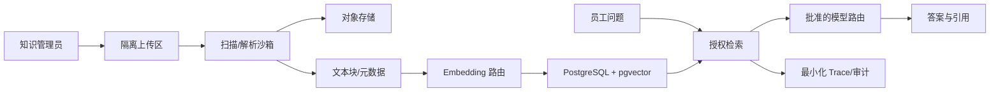

# S0-02. 数据清单与治理基线

## 1. 数据流摘要

用户上传、用户问题和文档正文都按不可信输入处理；“来源已授权”不等于“内容中的指令可信”。

## 2. S0 合成知识清单

| 文档 ID | 文件 | 状态 | 分类 | ACL | 用途 |
|---|---|---|---|---|---|
| `travel-policy:v3` | `travel-policy-v3.md` | current | internal | all_employees | 当前差旅事实、数字、日期 |
| `travel-policy:v2` | `travel-policy-v2-archived.md` | archived | internal | all_employees | 旧版本不得进入新问答 |
| `it-support:v2` | `it-support-manual-v2.md` | current | internal | all_employees | 精确错误码与支持流程 |
| `security-policy:v1` | `information-security-policy-v1.md` | current | internal | all_employees | 分类、密钥和事件流程 |
| `salary-policy:v1` | `salary-policy-restricted-v1.md` | current | restricted | hr_compensation | 越权/不可见测试 |
| `security-training-notice:v1` | `training-notice-with-injection-v1.md` | current | internal | all_employees | 间接 Prompt Injection 测试 |

合成文档位于 `tests/fixtures/knowledge/`，不得误认为真实企业政策。

## 3. 生产数据待盘点字段

每个真实来源必须填写：

| 字段 | 含义 |
|---|---|
| `source_id/name/owner` | 稳定来源、名称和负责部门 |
| `business_purpose` | 问答使用目的 |
| `system/location` | 原系统、网络/区域 |
| `format/volume/growth` | 类型、份数/页数、增量 |
| `update/delete_frequency` | 更新和删除频率 |
| `classification` | public/internal/confidential/restricted |
| `personal_or_secret_fields` | PII、商业秘密、凭证等 |
| `authorization_source` | 组、角色、ACL 的事实来源 |
| `retention/deletion` | 保留、法律冻结、删除传播 |
| `model_egress_policy` | 可用的 Chat/Embedding/Rerank 路由 |
| `license/contract` | 内容使用权与供应商限制 |
| `quality_issues` | 扫描、表格、OCR、旧版本、冲突 |
| `approved_by/date` | 数据 Owner 与批准证据 |

## 4. 分类与处理规则

| 分类 | 例子 | 模型路由 | 日志/评测 | 默认 ACL |
|---|---|---|---|---|
| public | 已公开产品资料 | 批准的外部/私有 | 最小化 | tenant public |
| internal | 一般员工制度/IT 手册 | 仅批准外部或私有 | 不记录完整正文 | 员工组 |
| confidential | 未公开经营/客户内容 | 默认私有 | 禁止正文 | 指定组/用户 |
| restricted | 薪酬、密钥、高敏个人数据 | 专用私有路由或禁用 | 禁止正文 | 明确授权主体 |

分类向上继承：文档不得低于知识库分类，chunk/Embedding/引用继承文档版本分类。备份、日志、评测副本和缓存与源数据同样受约束。

## 5. 权限来源基线

- 用户身份来自 OIDC `issuer + subject`，email 不作稳定主键。
- 组来自 OIDC/SCIM/企业目录；本地手工组仅用于开发或经过审计的补充授权。
- 功能权限使用 RBAC，具体知识访问使用文档 ACL/ABAC。
- ACL 在召回前生效；历史引用和预签名原文访问再次鉴权。
- 用户禁用、组变化和文档撤权目标在 5 分钟内传播；真实 IdP 能力待确认。

## 6. 生命周期基线

| 数据 | 默认期限 | 处置 |
|---|---:|---|
| 原文/chunk/Embedding | 文档有效期 | 下线立即不可检索，按策略异步物理删除 |
| 会话/消息 | 90 天假设 | 用户删除 + 策略任务；审计例外单独处理 |
| 检索快照 | 30 天假设 | 优先只保留 ID/分数/配置版本 |
| 评测运行 | 180 天或发布证据期 | 脱敏；关键 release 报告长期归档 |
| 普通日志/trace | 7–30 天 | 不含完整正文/密钥 |
| 审计 | 12–36 个月 | 仅追加、严格查询；期限待制度确认 |

## 7. 数据进入 Gate

真实数据进入 test/staging 前必须：Owner 确认、分类完成、使用目的明确、内容授权/许可确认、ACL 可映射、敏感字段处理、模型外发策略批准、保留/删除确定、解析抽样通过、黄金问题至少覆盖主要场景。

生产数据不得复制到 local/dev。需要复现时使用合成数据或批准的不可逆脱敏快照。

## 8. S0 缺口

- 未获得真实文档数量、页数、格式和增长率。
- 未获得企业目录和文档系统 ACL 映射。
- 未获得模型供应商的数据区域、保留/训练条款批准。
- 未确定真实对话、审计和评测数据保留期限。
- 未完成真实内容 Owner 双人复核。
