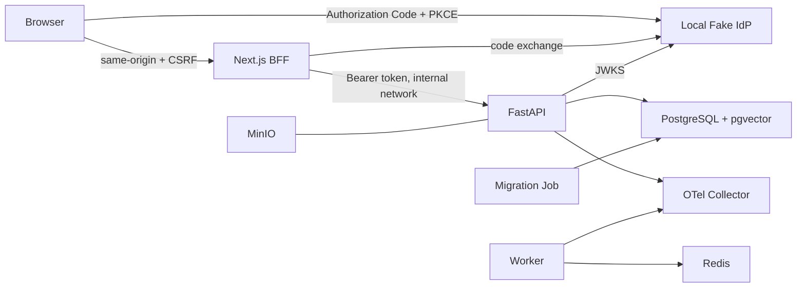

# S1 架构与安全设计

## 1. 运行架构

Web 与 Fake IdP 只在 loopback 暴露本地端口；PostgreSQL、Redis、MinIO 数据端口和 API 内部调用位于 Compose backend 网络。生产 Helm 不包含 Fake IdP，外部数据库/Redis/对象存储与企业 OIDC 由平台注入。

## 2. 组件责任

| 组件 | 责任 | 不承担 |
|---|---|---|
| Web/BFF | OIDC PKCE、HttpOnly 会话、CSRF、同源白名单代理、最小 UI | token 持久化到浏览器脚本、任意反向代理 |
| API | JWT 校验、身份映射、授权、租户作用域、会话业务、审计与健康检查 | 企业登录页面、模型/检索（S2/S3） |
| Identity Repository | `(tenant_id, issuer, subject)` 映射用户，加载角色权限与状态 | 信任客户端用户/租户字段 |
| Conversation Repository | 强制租户+用户作用域、keyset 分页、ETag 更新、审计 | 跨用户共享会话（未立项） |
| Migration | 版本化建表、索引、约束、可回滚 | API 启动时生产自动建表 |
| Worker | 后续异步任务进程边界与健康运行骨架 | S1 中不处理真实知识任务 |
| Fake IdP | 本地合成 OIDC 协议练习与测试 | 企业身份真实性、MFA、完整 OIDC 合规 |

## 3. 认证与可信租户上下文

1. BFF 生成高熵 `state`、PKCE verifier/challenge，将短期材料放入 HttpOnly cookie。
2. IdP 返回一次性 code；callback 同时校验 state，并使用 verifier 换 token。
3. API 从 `Authorization: Bearer` 读取 token。RS256 路径通过配置的 JWKS 验证签名；同时验证 `iss`、`aud`、`exp`、`iat`、`sub` 和 `tenant_id`。
4. `tenant_id` 只是签名声明中的定位键，最终用户状态、租户状态、角色与 permissions 仍从数据库查询。
5. Repository 只接收 Principal 中的 UUID；请求 body、query 和自定义 header 均不能覆盖作用域。

本地辅助 HS256 令牌只在 `QA_DEV_AUTH_ENABLED=true` 且 `local/test/dev` 允许。配置若在 staging/production 开启开发认证会直接启动失败。

## 4. 浏览器安全边界

- access token：HttpOnly、SameSite=Lax；Helm/生产默认 Secure；S1 Compose 因 loopback HTTP 显式关闭 Secure。
- CSRF：变更请求需要非 HttpOnly CSRF cookie 与 `X-CSRF-Token` 完全一致。
- BFF 代理：仅允许预定 `/api/v1` 方法/路径；不接受客户端提供的上游 URL 或 bearer token。
- XSS：token 不暴露给 React；仍需 CSP、依赖治理和输出转义作为生产加固。
- 登出：S1 删除本地会话 cookie；企业 IdP 的 RP-initiated logout 与全局会话撤销待联调。

## 5. 授权与隔离

授权分三层：有效租户/用户 → permission → Repository 数据作用域。系统角色 `employee` 当前含 `qa:ask`、`qa:conversation:read`、`qa:conversation:write`。权限名称稳定，角色组合可按租户配置。

数据层使用组合唯一键与组合外键保证关联记录的 `tenant_id` 一致。应用查询必须同时过滤 `tenant_id` 与 `user_id`；不可见会话统一 404。RLS 未在 S1 开启，保留为高敏/生产纵深防御；S3 实现文档 ACL 时必须重新评审。

## 6. 可观测性与审计

请求中间件生成或规范化 `X-Request-ID` 与 trace ID，响应返回 request ID。结构化日志只允许事件名、request/trace ID、method、path、status 和 duration 等安全字段；测试断言 Authorization、token 和 email 不出现。

会话 create/update/delete 写入 `audit_logs`：tenant、actor、action、resource、result、request ID、trace ID 与经过筛选的 details。S1 不记录请求正文、token 或 email。后续需要追加不可篡改归档、保留期与 SIEM 输出。

## 7. 部署与密钥

- Compose：本地合成开发，`.env` 不提交；服务依赖通过 healthcheck 和 migration completion 编排。
- Helm：API/Web/Worker 使用专用 ServiceAccount、非 root、禁止提权、只读根文件系统；迁移为独立 Job；Web 的 public URL、authorization/token endpoint 与 client ID 均为显式 values。
- Secret：Chart 只引用外部已有 Secret，不把值写进 values/configmap。生产必须对接 Secret Manager、TLS、NetworkPolicy、PodDisruptionBudget、资源配额与备份。
- Fake IdP：不会被 Helm 部署；生产 `QA_DEV_AUTH_ENABLED=false`。

## 8. 关联决策

- [ADR-009](../adr/ADR-009-development-oidc-isolation.md)：开发 OIDC 隔离。
- [ADR-010](../adr/ADR-010-mandatory-tenant-repository-scope.md)：Repository 强制作用域。
- [ADR-011](../adr/ADR-011-conversation-cursor-and-etag.md)：分页与乐观并发。
- [ADR-012](../adr/ADR-012-browser-bff-session.md)：BFF、cookie 与 CSRF。
- [ADR-013](../adr/ADR-013-reproducible-supply-chain-gate.md)：依赖与构建门禁。
