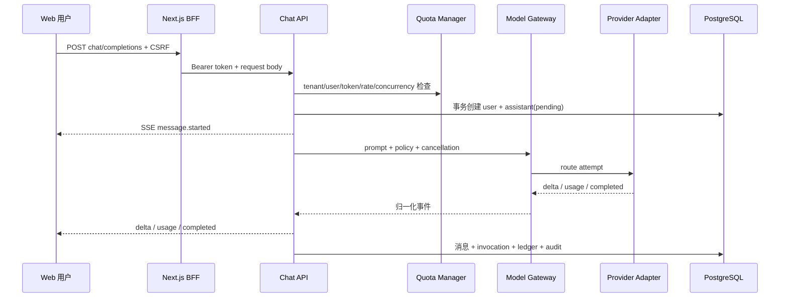

# S2 Model Gateway、韧性与安全设计

## 1. 组件与调用链

## 2. 模块责任

| 模块 | 负责 | 不负责 |
|---|---|---|
| `ChatService` | 鉴权后的业务编排、状态机、持久化、SSE 领域事件 | 供应商协议解析 |
| `ModelGateway` | 路由、并发、超时、重试、备用、熔断、错误归一化 | 租户资源授权、HTTP API |
| `ModelAdapter` | 单一 Provider 的请求/流解析和 usage 映射 | 业务重试策略、数据库 |
| `QuotaManager` | 请求速率、tenant/user 并发、输入 token 预估上限 | 多副本全局一致性（S2 未实现） |
| `CancellationRegistry` | 当前进程活动消息的取消事件 | 跨 Pod 协调（S2 未实现） |
| `ChatRepository` | 强制租户/用户作用域和事务一致性 | 路由选择 |

## 3. Adapter 契约

Adapter 接收统一 `ProviderRequest(prompt, locale, max_output_tokens)` 和取消信号，产生 `ProviderChunk(delta, usage, finish_reason)`。它必须：

1. 只把 Provider 协议转换为内部类型；不得自行决定业务重试或备用路由。
2. 在响应状态、SSE 数据或 JSON 无效时抛出归一化 `ModelProviderError`。
3. 不把 API key、完整原始响应、栈信息或敏感提示写入安全错误文案。
4. 支持连接时限、首 token 时限和总时限；调用结束可靠关闭响应连接。
5. usage 缺失时允许网关估算，但必须保存 `estimated=true`。

`OpenAICompatibleAdapter` 使用标准 HTTPS `/chat/completions` 流式协议；采用 HTTP 客户端而非厂商 SDK，避免 SDK 类型扩散。兼容不代表任何地址自动获批，正式端点仍受供应商、区域和数据政策审批。

## 4. 路由与故障策略

路由按策略过滤后按优先级尝试。`balanced` 是 S2 默认策略。每条路由有独立并发信号量与熔断器。

| 条件 | 动作 |
|---|---|
| 429、超时、5xx，尚未产生可见 delta | 当前 route 在次数预算内退避重试；耗尽后尝试下一 route |
| 4xx 参数/内容策略阻断 | 不重试，返回稳定错误 |
| 已产生可见 delta 后任意 Provider 错误 | 立即失败并保存部分内容；不切换模型拼接 |
| 连续可重试失败达到阈值 | 熔断 route；冷却期内快速跳过 |
| 所有 route 不可用 | 返回最后一个安全归一化错误；助手消息为 `failed` |

退避采用指数增长加随机抖动，并受总时限和 `model_max_attempts` 约束。这样降低同步重试风暴，但不会保证上游恢复。

## 5. 状态与事务边界

- 接受请求：在一个数据库事务内创建完成态用户消息和 `pending` 助手占位，避免孤立用户问题。
- 开始执行：助手进入 `streaming`；每个调用尝试追加一条 `model_invocations`。
- 成功：助手最终内容、route/model/token、`usage_ledger` 和审计同事务提交。
- Provider 失败：助手为 `failed`，保存稳定 `error_code` 和安全 detail；原始异常不入普通日志。
- 主动取消/客户端断开：助手为 `cancelled`，释放 tenant/user/route 并发许可。
- 进程启动：超过恢复阈值仍为 `pending/streaming` 的消息标记失败，避免永久悬挂。

## 6. 信任边界和数据流

1. BFF 只代理逐项白名单路径，写请求需要双提交 CSRF；浏览器不可读取 HttpOnly access token。
2. API 从已验证 token 和数据库身份记录获得 tenant/user，不接受请求体自报作用域。
3. 模型列表不返回 endpoint 或凭据。Provider key 仅从进程 Secret 环境变量读取。
4. S2 不向模型发送企业文档；知识模式被显式拒绝。将来 S4 必须在路由前执行数据分级策略。
5. Prompt 正文保存在消息表是产品功能所需，但普通日志不记录正文；数据库加密、访问审计和保留期仍需平台落地。
6. Helm 默认 Fake=false，真实 Provider=true，但模板值只是部署占位；没有批准端点和 Secret 时禁止安装到生产。

## 7. 可观测性要求

最低维度：`request_id, trace_id, tenant_id(内部受控), route_code, provider_code, model_code, attempt_no, status, error_code, latency_ms, input_tokens, output_tokens, estimated, amount, currency`。禁止将 key、Authorization、Cookie、完整上游响应和受限正文作为 label 或日志字段。

生产前还需补齐：TTFT/总耗时直方图、route 错误率、熔断状态、活动流、配额拒绝、取消率、token/金额按租户聚合告警，以及对应 dashboard/runbook。
