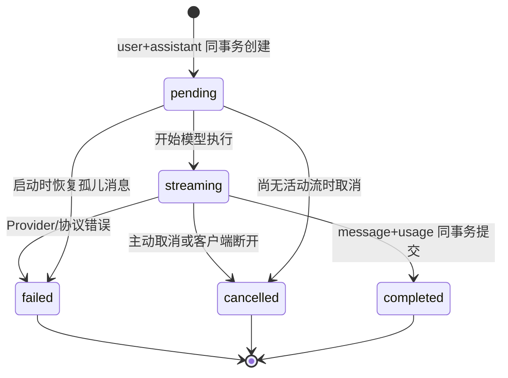

# S2 API、SSE、数据与成本设计

机器可读契约以 `../openapi.yaml` 为准；本文解释语义、状态和实现约束。所有业务接口前缀为 `/api/v1`，认证为 Bearer token，浏览器经 BFF 调用时还受 HttpOnly 会话和 CSRF 保护。

## 1. REST 接口

| 方法与路径 | 权限 | 作用 | 成功响应 |
|---|---|---|---|
| `GET /models` | `qa:ask` | 返回可用逻辑 route 与公共能力 | `200 ModelListResponse` |
| `POST /chat/completions` | `qa:ask` | 创建用户/助手消息并执行回答 | `200 JSON` 或 `200 text/event-stream` |
| `POST /messages/{id}/cancel` | `qa:ask` | 取消同租户、同用户活动消息 | `202 CancellationResponse` |
| `POST /messages/{id}/retry` | `qa:ask` | 对 failed/cancelled 助手消息新建重试 | `200 JSON/SSE` |
| `GET /conversations/{id}` | `qa:conversation:read` | 返回会话和已持久化消息 | `200 ConversationDetailResponse` |

### ChatCompletionRequest

| 字段 | 类型/约束 | 必填 | 语义 |
|---|---|---:|---|
| `conversation_id` | UUID | 是 | 必须属于可信 tenant 和当前用户 |
| `message` | string，1～8000 字符 | 是 | 用户问题；S2 不将其写入普通日志 |
| `stream` | boolean，默认 true | 否 | true 使用 SSE；false 聚合完整响应 |
| `model_policy` | `fast/balanced/quality` | 否 | 逻辑策略，不允许客户端指定 endpoint/key |
| `response_mode` | `general/grounded_answer/search_only` | 否 | S2 只接受 `general` |
| `knowledge_base_ids` | UUID[]，最多 20 | 否 | S2 必须为空 |
| `client_context.locale` | BCP 47 风格字符串 | 否 | 回答语言提示；不能作为权限依据 |

### ChatCompletionResponse

| 字段 | 类型 | 语义 |
|---|---|---|
| `request_id` | string | 请求关联 ID |
| `message` | MessageResponse | 最终助手消息，含 provider/model/finish_reason |
| `citations` | array | S2 固定为空；S4 前不得伪造 |
| `usage` | UsageResponse | token、估算标记、金额、币种 |

### RetryRequest 与 CancellationResponse

`RetryRequest` 只有 `stream` 和 `model_policy`；服务端从失败助手消息的 `parent_message_id` 找到原用户问题，不允许客户端替换原文。取消返回 `cancelling` 或 `cancelled`，重复取消已取消消息仍返回成功；已完成/失败消息返回 409；跨租户/跨用户统一 404。

## 2. SSE 协议

响应头包含 `Content-Type: text/event-stream`、`Cache-Control: no-cache, no-store`、`X-Accel-Buffering: no`。无业务事件 15 秒时发送注释心跳 `: keep-alive`。

每个业务事件格式：

```text
id: 3
event: message.delta
data: {"request_id":"...","message_id":"...","sequence":3,"created_at":"...","delta":"文本"}
```

| 事件 | 顺序 | 特有字段 | 说明 |
|---|---:|---|---|
| `message.started` | 第一个 | `model_policy` | 助手消息已进入 streaming |
| `message.delta` | 0..N | `delta` | 只追加显示，不作为独立数据库事务逐片保存 |
| `usage` | 成功时 1 | token、`estimated`、amount/currency | 在 completed 前出现 |
| `message.completed` | 成功/取消终态 | `finish_reason`, provider/model, trace_id | `stop/length/cancelled` |
| `error` | 失败终态 | `code`, `message`, `retryable`, `http_status` | 流已建立后不能改 HTTP 状态，因此以事件表达 |

`sequence` 对业务事件从 1 单调递增；心跳没有 ID。S2 不支持 `Last-Event-ID` token 续传，因为 delta 不逐片持久化。客户端断线后应读取会话详情；消息为 failed/cancelled 时可调用 retry。

## 3. 错误契约

非流式错误使用 `application/problem+json`：`type,title,status,code,detail,instance,request_id,retryable,errors?`。

| code | HTTP | retryable | 条件 |
|---|---:|---:|---|
| `KNOWLEDGE_NOT_AVAILABLE_IN_S2` | 409 | false | 请求知识模式或 KB ID |
| `CHAT_INPUT_TOKEN_LIMIT` | 413 | false | 预估输入 token 超上限 |
| `CHAT_RATE_LIMITED` | 429 | true | 用户分钟请求数超限 |
| `CHAT_CONCURRENCY_LIMIT` | 429 | true | tenant/user 并发超限 |
| `MODEL_RATE_LIMITED` | 429 | true | Provider 429 且路由预算耗尽 |
| `MODEL_TIMEOUT` | 504 | true | 连接/首 token/总时限 |
| `MODEL_UPSTREAM_ERROR` | 502 | 依错误而定 | 上游 5xx/协议失败 |
| `MODEL_CONTENT_BLOCKED` | 422 | false | Provider 内容策略拒绝 |
| `MESSAGE_NOT_CANCELLABLE` | 409 | false | 目标已结束 |
| `MESSAGE_NOT_RETRYABLE` | 409 | false | 目标非 failed/cancelled 或缺上下文 |

对外 detail 必须为安全文案。Provider 原始 body、headers、key、内部 endpoint 和堆栈不得透传。

## 4. 消息状态机



重试不修改旧消息状态，而是追加一个新的 assistant 消息并指向同一 user parent，保证失败证据不可变。

## 5. 数据字段

### `messages` S2 增量字段

| 字段 | 类型 | 规则 |
|---|---|---|
| `content_format` | varchar(20) | 当前为 `text` |
| `parent_message_id` | UUID nullable | assistant 指向触发它的 user message |
| `request_id` | varchar(64) nullable | 请求关联 |
| `finish_reason` | varchar(32) nullable | stop/length/cancelled/error |
| `provider_code/model_code/route_code` | varchar | 只保存内部代码，不保存 secret |
| `input_tokens/output_tokens/cached_tokens` | int | 非负，成功时由 usage 填充 |
| `error_code/error_detail_safe` | varchar | 稳定内部码和安全文案 |
| `updated_at/completed_at` | timestamptz | 状态更新时间和终态时间 |

### `model_invocations`

每次 Provider attempt 一行：`id, tenant_id, conversation_id, message_id, request_id, route_code, provider_code, model_code, attempt_no, status, error_code, retryable, latency_ms, started_at, completed_at`。它支持故障分析，不等同于计费账本。

### `usage_ledger`

成功回答一行且只追加：`id, tenant_id, user_id, conversation_id, message_id, request_id, provider_code, model_code, input_tokens, output_tokens, cached_tokens, estimated, input_price_per_million, output_price_per_million, amount, currency, occurred_at`。

金额按调用时价格快照计算：

`amount = input_tokens × input_price_per_million / 1,000,000 + output_tokens × output_price_per_million / 1,000,000`

不得用后来更新的价目表重算历史账单。S2 Fake 价格只用于验证计算链路，不代表采购报价。

## 6. 索引与保留

- 消息：按 `(tenant_id, conversation_id, sequence_no)` 唯一有序。
- 调用：按 `(tenant_id, request_id)`、`message_id`、`started_at` 查询。
- 用量：按 `(tenant_id, occurred_at)`、`request_id`、`message_id` 查询。
- 建议生产保留：消息遵循产品/法务保留策略；invocation 90～180 天；财务账本按财务政策。最终期限需业务、法务和安全批准。
