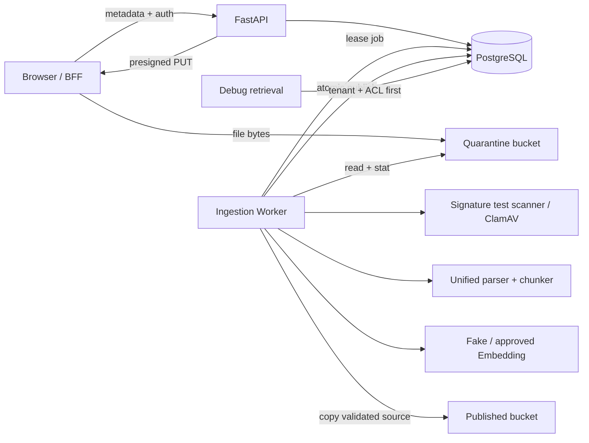
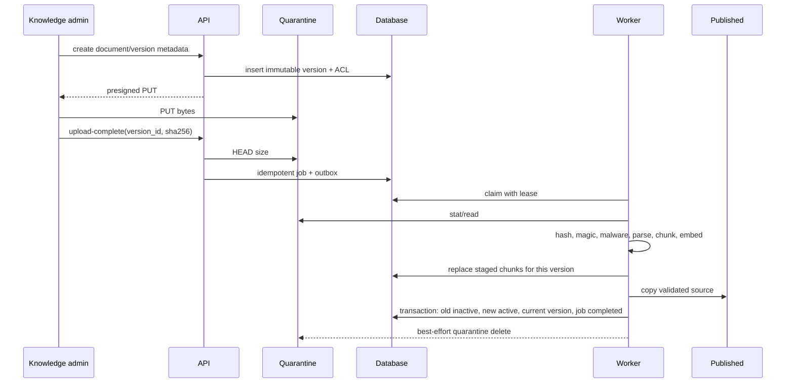

# S3 摄取架构与安全设计

## 1. 组件与责任



- API 负责身份、权限、元数据校验、ID/对象键生成、预签名、完成确认和只读状态。
- 对象存储负责大文件数据面；API 不代理生产 S3 文件正文。
- Worker 是唯一解析/扫描/Embedding/发布写入者。
- PostgreSQL 同时保存领域状态、任务租约、staged/published chunks、审计和 outbox。
- S3 调试检索直接使用已发布 chunk；S4 再引入 pgvector/full-text/hybrid/retrieval run。

## 2. 信任边界与数据流

1. 浏览器的 `tenant_id`、user、role、权限和对象键均不可信；由已验证 JWT 和数据库角色解析。
2. 文件名、MIME、大小和 SHA 都是声明，不能作为事实；Worker 从隔离对象重新计算。
3. 预签名只授权一个服务端生成 key、一个 bucket、PUT 和短有效期。文件名不拼接物理路径。
4. 本地签名 token 使用规范 Base64URL + HMAC-SHA256，绑定 version/key/bucket/MIME/max bytes/expiry；路径仍做 resolve 后父目录检查。
5. published bucket 只接收 Worker 复制的已验证对象；浏览器和 API 用户无 published 写权限。
6. 外部 Embedding 是出站边界；`confidential/restricted` 在调用前拒绝，密钥不持久化、不返回客户端。

## 3. 处理序列



## 4. 一致性与幂等

- 上传完成键：`upload:{version_id}:{sha256}`，tenant 内唯一。重复调用返回原 job。
- 手工重试键：`retry:{source_job_id}:{sha256(client_key)[:32]}`；不持久化原始幂等键。
- Worker 每次处理先删除该 version 的非 active staged chunks，再重建，避免崩溃后重复 chunk。
- 内容哈希复用只在同 tenant、同 embedding model、相同维数内进行，防止跨租户侧信道和模型混用。
- 对象复制和 DB 不能形成跨系统事务：先复制 published 对象，再执行 DB 发布事务。DB 失败可能留下不可见 orphan object，由后续 S5 reconciliation/lifecycle 清理；不会产生可检索半发布状态。
- DB 发布事务同时归档旧 active chunks、启用新 chunks、设置 `current_version_id`、更新版本 provenance、完成 job/outbox/audit。

## 5. Worker 租约和失败分类

领取条件：`status=queued AND available_at<=now`；PostgreSQL 使用 `FOR UPDATE SKIP LOCKED`，SQLite 测试串行领取。`running` 且 lease 过期的 job 回到 queued。

| 错误 | 可重试 | 结果 |
|---|---:|---|
| SHA/大小/MIME 不匹配、恶意内容、空文档、加密 PDF | 否 | `failed`，版本不发布 |
| 外部 Embedding 429/超时/5xx | 是 | 指数退避回 queued；耗尽 dead_letter |
| ClamAV 不可达/协议异常 | 是 | 同上 |
| confidential/restricted 走外部 Embedding | 否 | `EMBEDDING_ROUTE_FORBIDDEN` |
| 对象暂时不可读/复制失败 | 当前保守失败 | 操作员调查；生产前应按供应商错误码细化重试 |
| 未知内部异常 | 是 | 安全错误文案；详细堆栈只在服务日志 |

退避为 `min(60, 2^attempt)` 秒；默认最大 3 次。每次领取递增 attempt，租约 owner 不超过 128 字符。

## 6. ACL 与检索安全

安全候选集合必须同时满足：

```text
chunk.tenant_id = principal.tenant_id
AND chunk.is_active = true
AND chunk.status = published
AND document.status = ready
AND document.knowledge_base_id IN requested_kb_ids
AND EXISTS ACL(read, matching user_id or trusted role code)
```

只有得到安全候选集合后才计算词项分数和 top-k。管理员权限不绕过文档 ACL。当前 Principal 没有可信 group 列表，因此 group ACL 不匹配；接入企业 group/SCIM 时必须新增规范化 subject、撤权时效和缓存失效测试。

## 7. 解析安全

- PDF 使用 `pypdf` 严格解析；加密、损坏、无可提取正文均拒绝。
- DOCX 先确认 ZIP 和必要成员，再用 `defusedxml` 解析 `word/document.xml`；不执行宏、外链、嵌入对象。
- TXT/MD 只接受 UTF-8/UTF-8 BOM，拒绝 NUL。
- ZIP 解压只读取指定成员，不落地展开，降低 Zip Slip；上传大小先有硬限制。
- local 签名扫描器只识别 EICAR/合成标记，是测试替身；staging/production 配置强制 ClamAV INSTREAM。
- PDF/DOCX 解析库仍可能受复杂度攻击，生产前需容器 CPU/内存/时间限制和恶意语料 fuzz/回归。

## 8. 部署模型

Compose：API + PostgreSQL + MinIO + Worker + Fake IDP/Model/Embedding。MinIO 暴露本机 9000 供浏览器预签名 PUT，CORS 只指向 Web origin。API/MinIO 同时连接 non-internal frontend 与 internal backend，保证 Docker Desktop 能发布本机入口；端口只绑定 `127.0.0.1`。PostgreSQL/Redis/Worker 仍只在 internal backend，浏览器签名使用 public endpoint，服务端读写使用 internal endpoint。  
Helm：API/Worker 非 root、只读根文件系统；数据库、对象存储、模型和 Embedding 密钥由现有 Secret 名/键引用；bucket 由平台预建；HTTPS endpoints、ClamAV、真实 Embedding 为启动条件。

生产最小 IAM：

| 主体 | quarantine | published |
|---|---|---|
| API | presign Put/Head（或签名权限） | 无写权限 |
| Worker | Get/Head/Delete | Put/Copy/Get |
| Browser | 仅预签名 key 的限时 Put | 无 |
| 普通用户 | 无对象存储凭据 | 无；未来下载通过再鉴权 URL |

## 9. 威胁与控制

| 威胁 | 控制 | 残余风险 |
|---|---|---|
| 路径遍历/恶意文件名 | 文件名不入 key；UUID key；本地 resolve scope | 对象键策略变更需 ADR |
| MIME 欺骗 | magic + parser 双确认 | 多态文件需扩充检测库 |
| 恶意/压缩炸弹 | 大小限制、指定成员、ClamAV、非 root | parser CPU/内存隔离待压测 |
| 预签名 PUT 超额占用 | 声明大小门禁、completion HEAD 精确校验、Worker 读取上限、quarantine 隔离 | PUT 无 `content-length-range`；生产需 POST/上传网关或存储配额、短生命周期和告警 |
| 未发布内容被搜到 | staged + `is_active=false` + status 条件 | 运维直查 DB 需培训 |
| ACL 后过滤泄露 | SQL EXISTS 前置 ACL、跨租户测试 | group 生命周期未接入 |
| Worker 重复执行 | 幂等 staged 重建、唯一键、租约 | 多 Worker PostgreSQL 压测待办 |
| 外部模型数据外传 | 分类路由检查、HTTPS、Secret | DPA/区域/保留政策待批准 |
| 日志泄露 | 安全错误字段、无正文/签名 URL | 全链路 DLP 扫描待 S5 |
