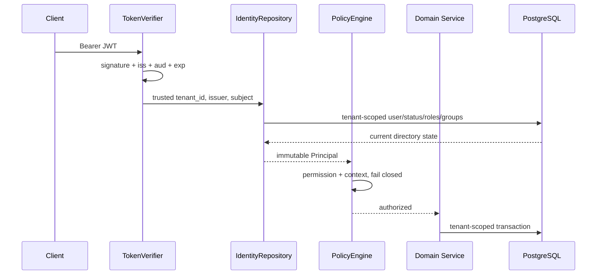

# S5 架构、身份与集中授权设计

## 1. 组件边界

| 组件 | 职责 | 不负责 |
|---|---|---|
| TokenVerifier | 验签、issuer/audience/exp、提取 subject/tenant | 不信任 token 中 role/group/permission |
| IdentityRepository | tenant-scoped 用户状态、有效角色、有效组解析 | 不做路由权限策略 |
| PolicyEngine | 显式 permission + tenant/owner 条件，默认拒绝 | 不查询数据库、不隐式授予 wildcard |
| GovernanceService | 用户生命周期、配置状态机、配额、审计、事件、摘要事务 | 不验证 JWT、不连接真实 SCIM/SIEM |
| QuotaManager | 聊天准入、共享窗口/租约、日/月事实检查 | 不作为最终账单，不协调跨实例取消 |
| RagService/IngestionService | ACL-first 检索和引用再鉴权 | 不接收客户端授权结论 |
| Governance Console | 读取安全摘要和导航 | 不绕过 API、ETag、审批或 CSRF |

## 2. 信任链



客户端不能通过请求体或 query 参数提交 `tenant_id`、角色、组或权限。即使 JWT 尚未过期，只要数据库用户变为 disabled，下一请求会在 Principal 解析阶段返回 `USER_DISABLED`。

## 3. Principal 字段

| 字段 | 来源 | 用途 | 敏感性 |
|---|---|---|---|
| `user_id` | users.id | owner/ACL/audit | internal identifier |
| `tenant_id/code` | 已验证 tenant claim + DB tenant | 强制租户作用域 | internal |
| `subject` | 已验证 JWT + DB 精确匹配 | 身份关联 | internal |
| `display_name/locale` | DB | UI/本地化 | personal/internal |
| `roles` | 有效 user_roles + roles | role ACL/展示 | internal |
| `groups` | active groups + 有效 group_members | group ACL/fingerprint | internal |
| `permissions` | 有效角色 permissions 合集 | PolicyEngine | security metadata |

`/me` 返回 groups/roles/permissions 供 UI 能力展示，但后续请求仍重新从服务端解析；客户端回传无效。

## 4. 本地角色/权限矩阵

| 权限 | employee | knowledge_admin | governance_admin | config_approver | auditor |
|---|---:|---:|---:|---:|---:|
| 问答/会话/反馈 | ✓ | — | — | — | — |
| 知识读写/摄取 | — | ✓ | — | — | — |
| 用户读写、组读取 | — | — | ✓ | — | — |
| 配置读/建 draft/评测/发布/回滚 | — | — | ✓ | 仅 read | — |
| 配置 approve | — | — | — | ✓ | — |
| 配额读写 | — | — | ✓ | — | — |
| 用量/质量摘要 | — | — | ✓ | — | ✓ |
| 审计读/验证 | — | — | ✓ | — | ✓ |
| 事件读/写 | — | — | ✓ | — | 仅 read |

生产角色不得照抄本地 persona；需由企业 IAM Owner 映射组织角色、审批职责和 break-glass 账户。

## 5. PolicyEngine 语义

```text
allow = permission ∈ principal.permissions
     ∧ (resource_tenant is absent or equals principal.tenant_id)
     ∧ (owner not required or owner_user_id equals principal.user_id)
```

- Permission 不支持前缀或 `*`，避免未来新增权限被旧角色意外继承。
- tenant/owner 不满足时返回 404，防止资源枚举；缺 permission 返回 403。
- 领域 Repository 仍必须带 tenant 条件；Policy 不是 SQL 隔离替代品。
- 高风险 denied 事件在生产应进入 SIEM；S5 当前治理链记录成功状态变化，普通拒绝由结构化请求日志/错误指标承接，这是未关闭项。

## 6. group ACL 查询顺序

安全候选条件为：

```text
tenant matches
AND document/version/chunk current and published
AND EXISTS document_acl(permission='read' AND one of:
    subject_type='user'  AND subject_id=current user UUID
    subject_type='role'  AND subject_id IN current server roles
    subject_type='group' AND subject_id IN current server groups)
```

该 EXISTS 在向量/FTS 排序和 limit 之前。引用详情查询重复相同授权条件。ACL fingerprint 覆盖 user、sorted roles、sorted groups，便于解释检索快照，不能用作授权缓存键而忽略实时状态。

## 7. 生命周期与同步契约

当前 API 只实现本地状态变更和读取，不是 SCIM endpoint。未来目录同步器必须：

- 以 `(tenant_id, auth_issuer, auth_subject)` 和 `(tenant_id, group.external_id)` 幂等 upsert。
- 使用 source revision/updated_at 拒绝乱序更新；删除采用 disabled/tombstone，不直接 hard delete。
- 同事务更新 membership 和 `identity_synced_at`，发布失效事件；缓存最大 TTL 不得超过停权 SLA。
- 监控 sync lag、失败、重复、未知组/角色映射；超过五分钟阻断生产或触发告警。
- 真实验证覆盖停权、组移除、角色到期、issuer 切换、重放、乱序和跨租户 external_id 冲突。

## 8. 失败语义

| 条件 | HTTP/code | 外部语义 |
|---|---|---|
| 未验签/过期 | 401 `TOKEN_*` | 重新认证 |
| 未 provision | 401 `IDENTITY_UNKNOWN` | 联系管理员 |
| tenant inactive | 403 `TENANT_INACTIVE` | 拒绝 |
| user disabled | 403 `USER_DISABLED` | 拒绝，下一请求生效 |
| permission missing | 403 `PERMISSION_DENIED` | 不暴露内部角色细节 |
| 资源跨租户/非 owner | 404 | 防枚举 |
| 自我停权 | 409 `SELF_DISABLE_FORBIDDEN` | 需另一管理员 |
| 版本陈旧 | 412 `ETAG_MISMATCH` | reload 后重试 |

