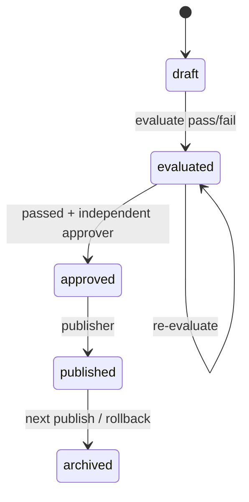
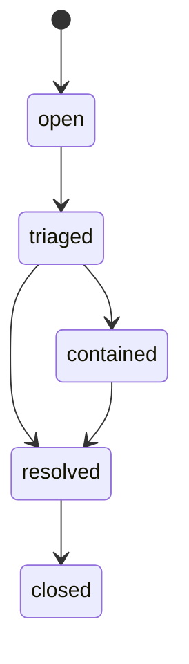

# S5 数据模型、字段字典与迁移

## 1. Alembic 版本

- 主治理 Revision：`20260716_0005`，down revision `20260716_0004`。
- 并发不变量加固 Revision：`20260716_0006`，down revision `20260716_0005`。
- 文件：`20260716_0005_s5_enterprise_governance.py` 与 `20260716_0006_s5_quota_and_config_invariants.py`。
- 策略：先 expand 新列/表，再由 S5 应用写入；生产大表迁移仍需目标数据量锁/WAL/复制演练。

## 2. 身份目录

### users 新字段

| 字段 | 类型 | 约束/默认 | 语义 |
|---|---|---|---|
| `version` | integer | not null, 1 | ETag 乐观并发 |
| `identity_synced_at` | timestamptz | nullable | 最后目录同步时间，不是登录时间 |
| `disabled_at` | timestamptz | nullable | 停权生效时间 |

### groups

| 字段 | 类型 | 约束 | 说明 |
|---|---|---|---|
| `id` | UUID | PK | 内部 ID |
| `tenant_id` | UUID | FK tenants；unique with id | 强制租户归属 |
| `code` | varchar(128) | unique(tenant,code) | ACL 稳定标识；改名需迁移 |
| `display_name` | varchar(200) | required | 展示名 |
| `external_id` | varchar(255) | nullable | 企业目录 ID |
| `status` | active/disabled | required | disabled 不进入 Principal |
| `version` | integer | ≥1 | 并发控制 |
| `identity_synced_at` | timestamptz | nullable | 同步新鲜度 |
| `created_at/updated_at` | timestamptz | required | 审计时间 |

索引：`(tenant_id,status)`。生产应按实际查询增加 `(tenant_id,external_id)` unique，前提是确认目录语义。

### group_members

联合主键 `(tenant_id,group_id,user_id)`；双复合 FK 防跨租户；`source` 区分 directory/manual-test，`valid_from/valid_until` 支持有效期。索引 `(tenant_id,user_id)` 服务 Principal 解析。

## 3. RAG 配置治理

### rag_configs 新字段

| 字段 | 说明 |
|---|---|
| `evaluation_status` | pending/passed/failed；与状态机分开便于失败后重评 |
| `change_reason` | 必填安全原因，不存完整工单正文 |
| `supersedes_id` | 被该版本替代的 published 版本 |
| `rollback_of_id` | 回滚 clone 的历史目标 |
| `approved_by/at` | 独立审批人和时间 |
| `approval_id` | 外部工单/审批引用 |
| `published_by/at` | 发布人和时间 |

状态约束扩展为 `draft/evaluated/approved/published/archived`。历史行不允许 PATCH；只有状态字段按合法工作流变化，Prompt/config/checksum 不变。`0006` 增加 partial unique index，数据库层保证每个 `(tenant_id,code)` 最多一个 `published`。

### rag_config_evaluations

| 字段 | 说明 |
|---|---|
| `dataset_version/checksum` | 服务器选择的测试集证据 |
| `evaluator_version` | 执行器版本 |
| `status` | 当前仅 completed；异步 Worker 后增加 queued/running |
| `gate_result` | passed/failed |
| `metrics/thresholds` | 安全聚合，不存样例原文 |
| `failed_checks` | 稳定检查码 |
| `created_by/at/completed_at` | 触发人和时间 |

索引 `(tenant_id,rag_config_id,created_at)`。生产 Worker 应额外保存制品 digest、Git SHA、运行环境和签名 report URI。

## 4. 配额

### quota_policies

以 `(tenant_id,scope_type,scope_id)` 唯一。字段：分钟请求、并发、日 token、月成本、币种、enabled、version、created/updated actor/time。当前 API 管理 tenant policy；数据模型预留 user override。

### quota_windows

唯一 `(tenant_id,user_id,window_kind,window_start)`；保存 `request_count` 和 `input_tokens_reserved`。它是准入窗口，不能用于财务结算。旧分钟窗口由后台维护任务清理（S5 acquire 只清理过期 lease，窗口清理仍待 scheduler）。

### quota_leases

每个活动聊天一行，含 tenant/user、`input_tokens_reserved`、acquired/expires。日 token 准入使用“已结算账本 + 未过期活动预留 + 当前估算”，避免并发请求同时越过日限额；正常终态删除预留，崩溃后 expires 自动失效。索引支持 tenant/user 活动计数和 TTL 清理。生产应加入定期物理清理和租约年龄告警。

## 5. 治理审计

`governance_audit_logs` 与普通 `audit_logs` 分开：

| 字段 | 说明 |
|---|---|
| `tenant_id, sequence_no` | 每租户唯一连续顺序 |
| `actor_user_id` | 服务端 Principal |
| `action/resource_type/resource_id/result` | 稳定动作语义 |
| `reason/approval_id` | 变更依据 |
| `request_id/trace_id` | 运行链路关联 |
| `details_safe` | 白名单安全详情 |
| `previous_hash/event_hash` | SHA-256 链 |
| `occurred_at` | hash 覆盖的 UTC 时间 |

hash canonical JSON 使用排序 key、紧凑分隔符和 UTF-8。tenant 行锁序列化同租户写入；unique 防重复 sequence。生产需要将 event_hash/完整事件外送 WORM，避免 DBA 重写全链。

## 6. 安全事件

`security_incidents` 字段包括 title/category/severity/status、safe evidence refs、owner、resolution_safe、version、creator/time/resolved_at。title 和 resolution 仍可能包含敏感信息，操作文档要求只写最小必要摘要；原始证据留在受控 SIEM/工单系统。

## 7. 状态机





## 8. 迁移运行与验证

```powershell
$env:QA_DATABASE_URL = "postgresql+psycopg://..."
.\.venv\Scripts\python.exe -m alembic upgrade 20260716_0006
.\.venv\Scripts\python.exe -m alembic current
```

验证：

1. `groups/group_members` 复合 FK 拒绝跨 tenant。
2. 现有 published config 的 `evaluation_status` 回填 passed；这是兼容回填，不等同生产审批证据。
3. PostgreSQL 旧 config status check 替换为 S5 状态集合。
4. `0006` 的活动 token 预留列和单 published partial unique index 生效。
5. upgrade → downgrade base → upgrade head 通过 SQLite 教学回归；生产必须对备份恢复点、锁时间和行数另行演练。

## 9. 回滚边界

代码发布前可以按 `0006 → 0005 → 0004` 回退；一旦真实治理事件/审批/组同步写入，继续物理 downgrade 会丢失证据，生产应优先前向修复。任何 downgrade 前必须暂停写流量、导出并校验审计链、创建数据库快照并取得 DBA/安全批准。
