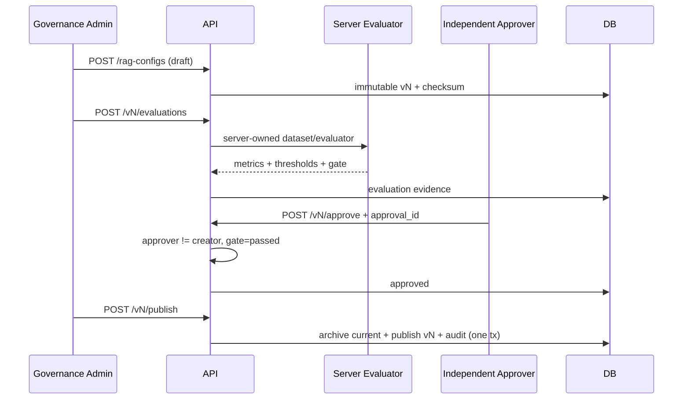

# S5 API 契约与治理工作流

完整机器契约见 `docs/enterprise-qa-system/openapi.yaml` 和运行时 `/api/v1/openapi.json`。所有 `/api/v1/admin/*` 请求必须经过 Bearer/OIDC、tenant Principal 和显式 permission；响应 `Cache-Control: no-store`。

## 1. 公共约定

- tenant_id 永不出现在管理请求体；由 token + DB 身份映射确定。
- PATCH 使用 `If-Match: "vN"`；缺失 428、格式错误 400、陈旧 412。
- 高风险写入必须带 10～500 字符 `reason`；审批型动作带 3～128 字符 `approval_id`，只允许字母数字和 `._:-`。
- 错误使用 `application/problem+json`，稳定 `code`，不返回 SQL、角色映射、Prompt 或供应商错误正文。
- 当前列表为 S5 小规模基线；users/groups/config/incidents 生产前必须补 cursor 和最大页限制。

## 2. API 清单

| Method/Path | Permission | 主要字段 | 成功 |
|---|---|---|---:|
| GET `/admin/users` | `qa:admin:users:read` | 用户/角色/组/同步时间/version | 200 |
| PATCH `/admin/users/{id}` | `qa:admin:users:write` | status/reason/approval_id + If-Match | 200 |
| GET `/admin/groups` | `qa:admin:groups:read` | code/status/member_count/sync time | 200 |
| GET `/admin/rag-configs` | `qa:rag-config:read` | immutable metadata/config/checksum | 200 |
| POST `/admin/rag-configs` | `qa:rag-config:write` | prompt_version/template/config/reason | 201 |
| POST `.../{id}/evaluations` | `qa:rag-config:evaluate` | 无客户端评测结果 | 201 |
| POST `.../{id}/approve` | `qa:rag-config:approve` | reason/approval_id | 200 |
| POST `.../{id}/publish` | `qa:rag-config:publish` | reason | 200 |
| POST `.../{id}/rollback` | `qa:rag-config:rollback` | reason/approval_id | 200 |
| GET/PATCH `/admin/quota-policies/tenant` | `qa:quota:read/write` | 限额、币种、enabled、version | 200 |
| GET `/admin/audit-logs` | `qa:audit:read` | after_sequence/limit/action | 200 |
| GET `/admin/audit-logs/integrity` | `qa:audit:verify` | 无 | 200 |
| GET `/admin/usage-summary` | `qa:usage:read` | from_time/to_time ≤31 天 | 200 |
| GET `/admin/quality-summary` | `qa:usage:read` | 同上 | 200 |
| GET/POST `/admin/security-incidents` | read/write | severity/category/evidence/owner | 200/201 |
| PATCH `/admin/security-incidents/{id}` | write | status/resolution/reason/approval + ETag | 200 |

## 3. 用户停权示例

```http
PATCH /api/v1/admin/users/00000000-0000-7000-8000-000000000102
Authorization: Bearer <governance-admin>
If-Match: "v1"
Content-Type: application/json

{
  "status": "disabled",
  "reason": "HR offboarding ticket approved and effective immediately.",
  "approval_id": "IAM-2026-1042"
}
```

返回 ETag `"v2"`。系统只记录 status/effective/version 等安全详情，不把 HR 工单正文复制进审计。管理员不能停权自己；跨租户 UUID 对调用者不可见。

## 4. 配置 Schema

`config` 必须精确包含：

```json
{
  "vector_candidates": 20,
  "lexical_candidates": 20,
  "rerank_candidates": 12,
  "final_k": 5,
  "rrf_k": 60,
  "context_max_tokens": 1200,
  "min_relevance": 0.28,
  "min_query_coverage": 0.34,
  "fusion": "weighted_rrf_v1",
  "vector_weight": 0.5,
  "lexical_weight": 0.5,
  "rerank_weight": 0.75
}
```

约束：final_k ≤ rerank ≤ vector/lexical，候选上限 500，context 小于 chat input budget，权重 0～1 且 vector+lexical=1，fusion 只能是评审过的版本。多余字段直接 422，避免客户端偷偷传供应商或脚本参数。

## 5. 配置工作流示例



本地 evaluator 检查 Schema、Prompt SOURCE 边界、引用/拒答条款和阈值，只能 local/test/dev。`QA_LOCAL_GOVERNANCE_EVALUATOR_ENABLED=false` 时 evaluation 返回 503 `EXTERNAL_EVALUATOR_REQUIRED`；这是生产 fail closed，不是系统故障降级到客户端评测。

## 6. 回滚语义

`POST /rag-configs/{historical_id}/rollback` 只接受 evaluation_status=passed 且曾 published/archived 的目标。返回的新行：

- `version = max(version)+1`
- `status=published`
- Prompt/config/checksum 与目标一致
- `rollback_of_id=historical_id`
- `supersedes_id=previous_current_id`
- 新 reason/approval/publisher/time 和治理审计

历史行不被重新激活或修改。当前实现把 rollback approval_id 视为外部紧急审批证据；生产需要把审批系统真实性校验或签名 webhook 纳入集成。

## 7. 配额 PATCH

```json
{
  "requests_per_minute": 60,
  "concurrent_requests": 12,
  "daily_token_limit": 500000,
  "monthly_cost_limit": "250.00",
  "currency": "USD",
  "enabled": true,
  "reason": "Approved capacity increase for pilot group.",
  "approval_id": "FINOPS-2026-0716"
}
```

修改后立即影响新准入，不中断已持有租约的请求。`enabled=false` 令新聊天返回 403 `CHAT_QUOTA_DISABLED`。账单事实仍来自 `usage_ledger`。

## 8. 审计查询

`GET /admin/audit-logs?after_sequence=0&limit=50&action=rag_config.published`

返回按 sequence 升序的 safe event 和可选 `next_sequence`。`GET /integrity` 从第一条重算；发现 sequence 空洞、previous hash 或 event hash 不匹配时返回 200 + `valid=false`，便于监控读取；调用本身不修改链。

## 9. 安全事件

创建示例：

```json
{
  "title": "Potential prompt injection detected in approved fixture",
  "category": "prompt_injection",
  "severity": "P2",
  "evidence_refs": ["trace:8f3a...", "ticket:SEC-1042"],
  "owner_user_id": "00000000-0000-7000-8000-000000000105",
  "reason": "Opened after synthetic red-team signal exceeded threshold."
}
```

合法迁移：open→triaged；triaged→contained/resolved；contained→resolved；resolved→closed。resolved/closed 必须给 `resolution_safe`。P0/P1 未 resolved 且无正式风险接受时 S5/生产 Gate 一票否决。

## 10. 主要错误码

| Code | HTTP | 可重试 | 场景 |
|---|---:|---:|---|
| `PERMISSION_DENIED` | 403 | 否 | 缺显式权限 |
| `SELF_DISABLE_FORBIDDEN` | 409 | 否 | 管理员停权自己 |
| `ETAG_MISMATCH` | 412 | reload 后 | 用户/配额/事件并发冲突 |
| `RAG_CONFIG_SCHEMA_INVALID` | 422 | 修请求 | key 不精确 |
| `RAG_CONFIG_BOUNDS_INVALID` | 422 | 修请求 | 参数越界 |
| `EXTERNAL_EVALUATOR_REQUIRED` | 503 | 配置后 | 非开发环境禁止 local evaluator |
| `CONFIG_EVALUATION_REQUIRED` | 409 | 先评测 | 未 passing 审批 |
| `SEPARATION_OF_DUTIES_REQUIRED` | 409 | 换审批人 | 创建人自批 |
| `CONFIG_APPROVAL_REQUIRED` | 409 | 先审批 | 未审批发布 |
| `ROLLBACK_TARGET_INVALID` | 409 | 换目标 | 未验证/未发布历史版本 |
| `CHAT_RATE_LIMITED` | 429 | 是 | 分钟窗口 |
| `TENANT/USER_CONCURRENCY_EXCEEDED` | 429 | 是 | 活动租约上限 |
| `DAILY_TOKEN_QUOTA_EXCEEDED` | 429 | 否 | 日 token |
| `MONTHLY_COST_QUOTA_EXCEEDED` | 429 | 否 | 月成本 |
| `INCIDENT_TRANSITION_INVALID` | 409 | 修状态 | 非法跳转 |

## 11. BFF 与 CSRF

Next.js BFF allowlist 已显式加入上述 admin path；任意不匹配路径返回 `BFF_PATH_DENIED`。GET 使用 HttpOnly access-token cookie；写请求还必须提交与 `qa_csrf` cookie 一致的 `x-csrf-token`。治理控制台当前只读，写流程可用 OpenAPI/受控客户端演练，避免 UI 隐式弱化审批。

