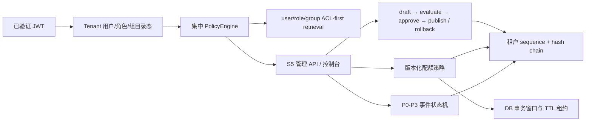

# S5 企业治理闭环证据包

> 版本：s5-v1.0-local-candidate  
> 日期：2026-07-16  
> 结论：本地/合成范围已实现，生产 No-Go；真实企业 IAM、外部评测 Worker、WORM/SIEM、跨实例取消、Kubernetes/性能/DR 和责任人签字仍未完成。

S5 把 S4 的可溯源 RAG 扩展为可管理、可审批、可审计的企业治理纵切。系统现在能从服务端目录态解析用户组，统一做权限判定，以状态机管理配置和安全事件，以数据库事务协调跨实例配额，并检测高风险治理记录被修改。管理控制台只展示安全摘要，不暴露 Prompt、正文或密钥。

## 文档导航

| 文档 | 内容 | 主要读者 |
|---|---|---|
| [01-需求与范围](01-s5-requirements-and-scope.md) | 需求 ID、场景、范围、验收和生产边界 | 产品/架构/测试 |
| [02-架构与权限设计](02-architecture-identity-and-policy.md) | 组件、信任边界、角色/权限、组 ACL、停权传播 | IAM/API/安全 |
| [03-数据模型与迁移](03-data-model-and-migration.md) | 表/字段/索引/状态机/0005～0006 迁移和回滚 | 后端/DBA |
| [04-API 与工作流](04-api-and-governance-workflows.md) | 管理 API、字段、示例、错误、ETag、审批流程 | 前后端/集成方 |
| [05-安全、配额、审计与运维](05-security-quota-audit-and-operations.md) | 威胁控制、OWASP GenAI 映射、配额、哈希链、事件与 Runbook | 安全/SRE/审计 |
| [06-开发教学与测试](06-development-tutorial-and-test-plan.md) | 分步实现、故障注入、测试矩阵与学习目标 | 开发/测试 |
| [07-测试与验证报告](07-test-and-verification-report.md) | 静态、功能、迁移、Web、容器和供应链证据 | 全团队 |
| [08-S5 Gate](08-s5-gate-review.md) | 条件结论、未关闭项、S6 授权与禁止事项 | 评审委员会 |
| [09-决策日志](09-decision-log.md) | 重要取舍、替代方案和影响 | 架构/Owner |
| [10-风险登记](10-risk-register.md) | 风险、证据、Owner、缓解和关闭条件 | 项目/安全/SRE |
| [manifest.yaml](manifest.yaml) | 机器可读交付清单和 Gate 状态 | CI/发布 |

## 已实现纵切



## 本地角色

| Persona | subject | 用途 | 是否可用于生产 |
|---|---|---|---:|
| 员工/知识管理员 | `demo-employee` | 问答、知识摄取、组 ACL 演示 | 否 |
| 治理管理员 | `governance-admin` | 用户、配置评测/发布/回滚、配额、事件、摘要 | 否 |
| 独立审批人 | `config-approver` | 审批 passing 配置，不可创建/发布 | 否 |
| 审计员 | `demo-auditor` | 只读审计/完整性/用量/事件 | 否 |

本地 OIDC 可设置 `QA_OIDC_DEV_PERSONA=governance` 登录控制台；开发令牌也可运行：

```powershell
$admin = & .\.venv\Scripts\python.exe apps\api\scripts\issue_dev_token.py governance
$approver = & .\.venv\Scripts\python.exe apps\api\scripts\issue_dev_token.py approver
$auditor = & .\.venv\Scripts\python.exe apps\api\scripts\issue_dev_token.py auditor
```

## 一票否决边界

- 不得把本地 structural evaluator 的 passing 当作真实业务质量证明。
- 不得把数据库哈希链称为 WORM 或不可抵赖；必须外送企业 SIEM/WORM。
- 不得宣称已完成 SCIM/企业组同步、真实停权传播演练或审计员/数据 Owner 签字。
- 不得在跨实例取消、真实告警、Kubernetes、性能、恢复和供应商审批缺失时批准生产。
- 只允许继续使用合成、公开或明确批准的非敏感数据。
