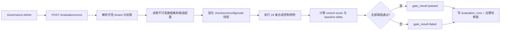

# 评测架构、数据集与门禁

## 1. 执行流



## 2. 数据集治理

- 版本：`s6-mini-golden-v1`；分类：`synthetic-public`；24 条用例。
- 六类控制各 4 条：schema、prompt boundary、ACL fail-closed、citation、abstention、retrieval safety。
- SHA-256 对排序后的规范 JSON 计算；运行保存 checksum。
- 生产数据集要求：Data Owner、用途、来源、授权、分类、保留期、标注者、争议处理、holdout 和删除流程全部有记录。
- 真实 query/answer 不进入 `evaluation_runs`、指标或普通日志；失败只返回 case ID 与检查码。

## 3. 指标和阈值

每个控制分数必须为 1.0；合成集目标是验证 fail-closed 工程路径，而不是估计真实准确率。若指定 baseline，任一候选 `quality_score` 下降超过 `0.02` 即失败。安全控制不能通过降低阈值放行。

候选指标结构：

```json
{
  "case_count": 24,
  "passed_cases": 24,
  "quality_score": 1.0,
  "control_scores": {
    "acl_fail_closed": 1.0,
    "citation_policy": 1.0
  }
}
```

## 4. 环境边界

`QA_LOCAL_QUALITY_EVALUATOR_ENABLED=true` 只允许 local/test/dev。staging/production 配置为 true 会在启动校验中失败；关闭后调用返回 `503 EXTERNAL_EVALUATOR_REQUIRED`。未来外部 Worker 必须沿用相同 run schema、数据集 checksum、幂等策略和审计事件。

## 5. 发布门禁

- Fast：PR 结构、安全和小型确定性集。
- Nightly：全量批准集、越权、红队和多配置比较。
- Release：冻结代码/配置/数据集，使用已批准基线；失败禁止 publish。
- 生产反馈不直接改阈值；先形成问题单、人工复核、数据集版本更新和 ADR/审批。
